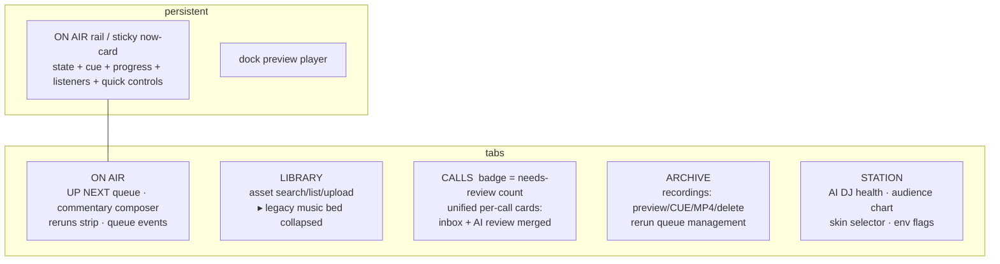

# Control-room UI redesign — audit + proposal

> **Status:** Implemented locally in `admin/ui.html` on 2026-07-07. Nothing here is deployed.
> **Scope:** `admin/ui.html` (and, optionally, two tiny projection additions in `admin/server.js` / `bot/src/api.ts`). No framework, no dependency, no brand redesign — Inter UI, pixel wordmark, cream/paper/teal/ink stay.
> **Mock:** an ephemeral static mock with fake data lives at `/var/folders/2j/6mslx1715gx8frsyn66sf1sh0000gn/T/opencode/admin-redesign/mock.html`, with screenshots `mock-desktop.png` (1440×900) and `mock-mobile.png` (390pt). It is not in the repo and must not be committed.

---

## 1. Current UX audit

### 1.1 Panel + action inventory (today's DOM order)

| # | Panel | Data source (poll) | Actions |
| --- | --- | --- | --- |
| 1 | **NOW** (dark card) | `/api/state` (5s) | FIRE TIME CHECK |
| 2 | **AUDIENCE — LAST 7 DAYS** | `/api/audience` (5m) | none (canvas chart) |
| 3 | **HOTLINE — (361) 266-6259** | `/api/state` | preview, AIR, archive/restore, delete-forever; archived list in `<details>` |
| 4 | **HOTLINE — AI QUEUE** | `/api/automation/hotline` (every 3rd 4s tick) | approve, reject, restore (all `confirm()`) |
| 5 | **RERUN QUEUE** | `/api/state` | AUTO toggle, SKIP CURRENT, remove-from-queue |
| 6 | **ARCHIVE** | `/api/state` | preview, MP4 render/download, CUE (→ rerun queue), delete |
| 7 | **MUSIC BED** (legacy) | `/api/state` | preview, ACTIVATE, delete, upload |
| 8 | **ASSET LIBRARY** (automation) | `/api/automation/catalog` (on demand) | search, load more, preview, +QUEUE, ARCHIVE/RESTORE asset, upload w/ metadata |
| 9 | **AI QUEUE** | `/api/automation/queue` (4s) + `/history` | REFRESH, ADD COMMENTARY; events in `<details>` |
| 10 | **AI DJ** | `/api/automation/dj` (every 3rd tick) | none (status + env-flag note) |
| 11 | **WEB PLAYER SKIN** | `/api/state` | AUTO DAILY, PREVIEW, ACTIVATE (pin) |
| — | **Dock** (fixed bottom) | — | shared preview player: play/pause, seek, close |
| — | **Toast** (fixed bottom) | — | only error/success surface, auto-dismisses at 2.2s |

Eleven visually identical cream cards in one 900px column. On a laptop that is roughly **five screens of scrolling**; on a phone, eight or more.

### 1.2 Hierarchy problems

- **"What is playing right now" is fragmented across three panels.** The NOW card knows humans/rerun/intermission and the *legacy* bed track. The actual current automation cue (type, title, artist, offset/duration) is a one-line muted string inside AI QUEUE — the **ninth panel**, several screens below the fold. Rerun pause/next state is a third string inside RERUN QUEUE. The owner's core glance task requires scrolling and mentally joining three sentences.
- **No progress visualization anywhere.** Current cue progress renders as `@ 1m23s / 3m45s` in muted 0.78rem text.
- **Flat weight.** All 11 sections use the same card, the same h2 treatment, the same table style. Nothing signals frequency-of-use or importance; navigation is scroll-position memory.
- **Above-the-fold budget is spent on the audience chart** (analytics, a weekly-glance artifact) while queue and hotline sit below it.

### 1.3 Confusion / duplication

- **Two hotline panels** ("HOTLINE — number" and "HOTLINE — AI QUEUE") show the *same calls* through two different projections (private inbox vs PII-redacted moderation view). The relationship is explained only in a footnote; the same call appears twice with different row shapes and different action sets.
- **Two music systems with two uploads.** MUSIC BED (legacy looping bed files) and ASSET LIBRARY (automation catalog) both say "upload mp3". Which one "adds music to the station" depends on whether automation playout owns the air — nothing on the page says which upload the listener will actually hear.
- **CUE lives in ARCHIVE, its consequence lives in RERUN QUEUE** — two screens apart, with no cross-reference after clicking.
- **Rerun ownership duality** is compressed into one dense button label: `🔁 AUTOMATION AUTO: ON`. Owner (automation vs legacy), availability (OFFLINE), and the toggle state are three orthogonal facts fused into one string.
- Emoji-as-icon is inconsistent (⏭️ ✅ 🗑️ 📡 ➕ 🎬 …) and carries meaning that isn't otherwise stated on small rows.

### 1.4 Polling / state issues

- **Two cadences, three failure surfaces.** `/api/state` every 5s, automation tick every 4s (DJ/hotline/events every third tick), audience every 5m. Automation-down flips four info lines to ⚠️ but stale table rows *stay rendered*; bot-down surfaces only as a transient toast.
- **Full innerHTML rebuild every 5s** for all legacy panels (`render()` regenerates every table). Consequences: text selection lost, `<details>` open state survives only by luck of not being re-rendered, buttons can be swapped under a moving cursor mid-click, and screen readers see churn. `renderIfChanged` exists but only guards the automation panels.
- **No freshness indicator.** There is no "updated Ns ago"; a wedged poll looks identical to a calm station.
- Polling continues when the tab is hidden (battery/network waste on mobile).

### 1.5 Action-safety issues

- `button.danger` **only styles `:hover`** — at rest, delete-forever looks identical to preview. On touch devices (no hover) the danger affordance never appears at all.
- Six native `confirm()` dialogs with long paragraph copy (hotline approve/reject, asset retire/restore, deletes). Native confirms are keyboard-accessible but unstyled, easy to reflex-accept, and show raw filenames.
- Reversible actions (archive voicemail, unqueue) and irreversible ones (delete forever) currently read at the same visual weight.

### 1.6 Mobile / accessibility issues

- Buttons are `.32rem` vertical padding → **~26px targets** (guideline: 44px).
- 5–6-column tables rely on `.scroll` horizontal panning; transcripts render as pseudo-rows (`colspan` with `border-top:none`) that confuse row semantics for screen readers.
- Landmarks: one `<main>`, no `<nav>`, no `aside`; h2s are visual labels. Tab order = DOM order, so reaching skins takes dozens of stops.
- Muted text `--brown-dim #8a7458` on `--cream #efe0cc` ≈ **3.5:1** — fails WCAG AA (4.5:1) for the small text it is used on (transcripts, info lines, table headers).
- Only live regions are the toast and two `role="status"` info lines; NOW status changes are not announced.
- Audience canvas has a good `aria-label` + text stats (keep), but no tabular alternative.

### 1.7 What already works (keep)

- Server-side security posture: allowlist proxy, projections, same-origin gate, CSP nonce — the redesign must not loosen any of it.
- **Honest env-flag messaging** (DJ mode / playout flags are labeled "env change required", never fake toggles).
- Fail-soft automation-offline behavior (concept is right; presentation needs work).
- The shared dock preview player, `fmtSession` humanized names, transcript-first hotline flow, idempotency/revision-conflict handling with human-readable toasts.

---

## 2. Personas and top tasks

One real persona — **the owner-operator** (occasionally a trusted cohost), on desktop while working and on a phone the rest of the day. Ranked tasks:

| Rank | Task | Frequency | Today's cost |
| --- | --- | --- | --- |
| 1 | Glance: is the station healthy, what's on air, how many listeners? | many times daily, often mobile | NOW card answers ⅓; rest is below the fold |
| 2 | See current cue + progress + source (automation/legacy/live) | many times daily | buried in panel 9, text-only |
| 3 | See what's coming next (queue depth, next cues) | daily | panel 9, plain table |
| 4 | Add music / queue a track / add commentary | weekly+ | panels 7, 8, 9 — three places |
| 5 | Moderate hotline (read transcript → air now or approve for DJ) | per call | two panels, duplicated rows |
| 6 | Control reruns (auto, skip, cue from archive) | weekly | panels 5+6, split |
| 7 | Manage archive (mp4, delete) | weekly | fine, just far down |
| 8 | Pin/restore a skin | rare | fine, bottom is acceptable |
| 9 | Diagnose (DJ lease/budgets, queue events, audience) | when something smells off | scattered: panels 2, 9-details, 10 |

Design rule that follows: **tasks 1–3 must be answered with zero scrolling on every device**; tasks 4–6 one interaction away; 7–9 may live behind navigation.

---

## 3. Proposed layout

### 3.1 Desktop (≥1100px): sticky ON AIR rail + tabbed workspace

```text
┌────────────────────────────────────────────────────────────────────────────┐
│ ▩ ANOMALY.FM  CONTROL ROOM      [ON AIR] [LIBRARY] [CALLS •2] [ARCHIVE]    │
│                                                              [STATION]     │
├──────────────────────┬─────────────────────────────────────────────────────┤
│  ON AIR RAIL (aside, │  WORKSPACE (main, switches with tabs)               │
│  sticky, 340px)      │                                                     │
│ ┌──────────────────┐ │  ON AIR view:                                       │
│ │ INTERMISSION     │ │  ┌───────────────────────────────────────────────┐  │
│ │ AUTOMATION  ·2s  │ │  │ UP NEXT      rev 212 · 14 READY (52m) · 2 gen │  │
│ │ ┌────┐ MUSIC     │ │  │ 1 🎙 Commentary — after this…   0:24 ⏳GEN    │  │
│ │ │ ♪  │ PLAYING   │ │  │ 2 ♪  Night Frequencies · DTS    4:12 ✅READY  │  │
│ │ └────┘ Signal    │ │  │ 3 ☎  Hotline group “…midnight”  3:05 ✅READY  │  │
│ │  Through Rain    │ │  │ 4 ◈  Station ID — 11 PM slot    0:18 ⏸HELD   │  │
│ │  Example Artist  │ │  │ ▸ recent queue events (incl. failures)        │  │
│ │ ▓▓▓▓▓░░░░░░░░░░  │ │  └───────────────────────────────────────────────┘  │
│ │ 1:28        3:58 │ │  ┌───────────────────────────────────────────────┐  │
│ │ LISTENERS HUMANS │ │  │ ADD DJ COMMENTARY  [textarea]                 │  │
│ │ 7 (5w·2yt)  0    │ │  │ [🎙 ADD COMMENTARY]  ≤180 words · screened    │  │
│ │ QUEUE   RERUN    │ │  └───────────────────────────────────────────────┘  │
│ │ 14·52m  AUTO ON  │ │  ┌───────────────────────────────────────────────┐  │
│ │ [📢 TIME CHECK]  │ │  │ RERUNS  [🔁 AUTO: ON]  next: Jul 5 9:02 PM…   │  │
│ │ [⏭ SKIP RERUN]   │ │  └───────────────────────────────────────────────┘  │
│ │ DJ SHADOW · env  │ │                                                     │
│ └──────────────────┘ │  (LIBRARY / CALLS / ARCHIVE / STATION views swap    │
│ ┌ HOTLINE mini ────┐ │   in here; the rail never leaves)                   │
│ ┌ AUDIENCE mini ───┐ │                                                     │
├──────────────────────┴─────────────────────────────────────────────────────┤
│                [dock preview player, unchanged, fixed bottom]              │
└────────────────────────────────────────────────────────────────────────────┘
```

**The rail is the single source of "now".** It merges what today lives in NOW + AI QUEUE's now-line + RERUN QUEUE's paused-line:

- **Air state badge** — `ON AIR` (danger red, member names) / `RERUN` / `INTERMISSION` / `OFF AIR` / `OFFLINE` (bot unreachable).
- **Source badge** — `AUTOMATION` or `LEGACY` (from `rerun.owner` + queue flags), plus `updated Ns ago` freshness.
- **Current cue card** — type glyph tile (♪ / 🎙 / ☎ / ◈ / 📼; CSS-generated, no image assets), title/artist from `public_metadata`, state (`PLAYING`), progress bar + times.
- **Stat cells** — listeners (total, web·yt), humans in channel, queue depth (READY count + minutes), rerun auto state.
- **Immediate controls** — TIME CHECK; SKIP RERUN (only when a rerun is actually playing); rerun AUTO toggle either here or in the RERUNS strip (see decisions).
- **Env-flag line** — read-only: `DJ mode SHADOW · playout ON — env flags, change via deploy`.

### 3.2 Current-cue resolution (must match data reality)

The rail computes one cue from existing polled data, in priority order:

| Priority | Condition | Rail shows | Progress source |
| --- | --- | --- | --- |
| 1 | `snapshot.humans > 0` | `ON AIR` + member names; recorder implied | none (open-ended) — elapsed not available in `/api/state`; omit or add later |
| 2 | hotline/announcement airing (`bot.voicemails.airing`) | `HOTLINE / ANNOUNCEMENT AIRING` chip layered on top | none |
| 3 | automation cue with `state ∈ {PLAYING, CLAIMED}` in `/api/automation/queue` | type glyph, `public_metadata.title/artist`, state | `last_offset_ms / planned_duration_ms` |
| 4 | legacy `rerun.playing` | 📼 tape glyph + humanized session name | `rerun.position` / duration joined client-side from `state.recordings[].meta.durationSeconds` — **no backend change needed** |
| 5 | `bot.music.track` (bed) | ♪ bed glyph + track name + `LOOPING BED` label | **no bar** — the bed loops; showing progress would be a lie |
| 6 | bot unreachable | `OFFLINE` state, controls disabled | — |

`last_offset_ms` is heartbeat-persisted and has no timestamp in the projection. The bar should interpolate client-side from receipt time, clamp at `planned_duration_ms`, and visually mark itself approximate (no seconds-precision claim). A one-line server addition (`as_of` in `projectQueue`) makes it honest — see §10.

### 3.3 Mobile (<1100px)

- Single column; the tab nav scrolls horizontally under the wordmark.
- The **now-card compacts and sticks to the top** (`position: sticky`) so air state + cue + progress survive any scroll depth. Stat cells stay (2×2); mini-cards (hotline/audience) hide — their content lives in their tabs.
- Cue rows drop index + length columns; title truncates with ellipsis; badge stays.
- All tables become stacked card-rows (CSS grid, no `<table>` where the data is really a list of entities with actions — see §5).

Verified in the mock screenshots (`mock-desktop.png`, `mock-mobile.png`).

---

## 4. Information architecture



| Content | Today | Proposed home | Rationale |
| --- | --- | --- | --- |
| NOW card | panel 1 | **rail** (persistent) | task 1 |
| AI QUEUE now-line | panel 9 | **rail** (merged) | task 2 |
| AI QUEUE upcoming cues + composer | panel 9 | **ON AIR** tab, first | task 3–4; queue above the fold |
| Rerun AUTO/SKIP + next/paused info | panel 5 | **ON AIR** tab strip (+ SKIP in rail while playing) | program control, glance-adjacent |
| Rerun queue rows (remove) | panel 5 | **ARCHIVE** tab, beside recordings | CUE and its consequence finally co-located |
| Queue events `<details>` | panel 9 | ON AIR tab, collapsed (default) | diagnosis, not glance |
| HOTLINE inbox + HOTLINE AI QUEUE | panels 3+4 | **CALLS** tab, one card per call | kills the duplication (see §5.4) |
| ASSET LIBRARY | panel 8 | **LIBRARY** tab | task 4 |
| MUSIC BED (legacy) | panel 7 | LIBRARY tab, collapsed "LEGACY BED (fallback loop)" | demoted, clearly labeled as the safety bed, not "the music" |
| ARCHIVE recordings | panel 6 | **ARCHIVE** tab | unchanged |
| AI DJ status | panel 10 | **STATION** tab | diagnosis |
| AUDIENCE chart | panel 2 | STATION tab (rail keeps a one-line summary mini-card) | weekly glance ≠ every-visit real estate |
| WEB PLAYER SKIN | panel 11 | STATION tab | rare task |

**Removed entirely:** the AI QUEUE "REFRESH" button (polling already runs every 4s; a manual refresh that races the tick is noise). **Merged:** the two hotline panels; the two "now" strings.

Tabs are plain hash-routed `<nav>` links (`#onair`, `#library`, …) toggling `hidden` on five view containers — no router, no dependency, deep-linkable, and back-button friendly. The CALLS tab label carries a needs-review count badge (from data already polled).

---

## 5. Component behavior and states

### 5.1 Rail / now-card

| State | Trigger | Presentation |
| --- | --- | --- |
| LIVE | `humans > 0` | red `ON AIR` badge, member names as title, glyph 🎤; SKIP hidden; TIME CHECK still available (bot re-checks presence; keep the force-confirm) |
| PLAYING (automation) | cue PLAYING/CLAIMED | teal accents, progress bar animating (§8) |
| RERUN (legacy) | `rerun.playing` | tape glyph, session name, position/duration bar |
| BED | none of the above, `music.state` ok | `LOOPING BED` label, no bar, calm |
| GENERATING-only queue | no current cue, `generating_count > 0` | "next cue rendering…" subtitle |
| AUTOMATION OFFLINE | 503 from proxy | source badge → `OFFLINE`; automation-derived cells show `—`; legacy data keeps rendering; one inline warnbox, not four |
| BOT OFFLINE | `/api/state` failing | whole rail dims to a labeled `OFFLINE — station state unreachable` card; all mutating controls disabled; freshness turns `stale Ns` after 2 missed polls |
| EMPTY queue | `ready_count = 0` | queue cell shows `0 READY` in danger tint — this is the "station will fall to bed/filler" early warning |

Freshness: `updated 2s ago` ticks from last successful poll of *each* source; either source going stale is visible without reading logs.

### 5.2 UP NEXT queue rows

Card-rows (not `<table>`): index · type glyph · title/artist (truncating) · length · state badge. Badges keep today's text+glyph vocabulary (✅ READY / ⏳ GENERATING / ⏸ HELD FOR SLOT for `not_before` station IDs / ⚠️ FAILED / ❌ CANCELED). Rows are display-only (the seven-tool contract gives admins no reorder/delete of DJ cues — do not invent fake affordances). The current cue is *never* in this list (it lives in the rail). `renderIfChanged` keying stays.

### 5.3 Commentary composer

States: idle → submitting (button disabled + `⏳`) → accepted (toast + textarea cleared + a GENERATING row appears in UP NEXT within one tick — that row *is* the confirmation) → conflict (`REVISION_CONFLICT` toast: "queue changed underneath you — try again", textarea content **preserved**) → rejected (PII/unsafe/cadence code mapped to the existing fixed messages, content preserved). Character counter at ≥80% of the 2000 cap. When automation is down the composer collapses to its offline notice instead of a dead textarea.

### 5.4 CALLS — unified per-call card

One card per call, joined client-side on `vm-` timestamp / `call_id` (both projections are already polled):

```text
┌──────────────────────────────────────────────────────────────┐
│ Jul 6 · 11:42 PM · •••-6259 · 1m12s          🔍 NEEDS REVIEW │
│ 🗒 “transcript text …”                                        │
│ [▶ preview] [📡 AIR NOW]   AI: [✅ APPROVE] [❌ REJECT]       │
│ ▸ details: screen result · moderation v4 · archive           │
└──────────────────────────────────────────────────────────────┘
```

- Top half = private inbox truth (masked number, audio preview, AIR NOW to the live mixer queue, archive/delete under the details disclosure).
- Bottom half = AI moderation (status badge, approve/reject/restore with moderation-version optimistic concurrency, `AIRED` terminal = badge only, no actions).
- The PII boundary stays explicit: a fixed footnote on the AI action group — "the DJ sees only this redacted transcript, never the number or raw audio".
- Filters: `INBOX` (default) / `NEEDS REVIEW` / `ALL + archived`.
- A call present in only one projection renders with the other half labeled unavailable (automation offline, or not yet imported).

### 5.5 LIBRARY

Search-first (existing form), then rows: title · artist · tags · length · status badge (`READY/PROCESSING/QUARANTINED/FAILED/RETIRED`) · actions (preview, ＋QUEUE, ARCHIVE/RESTORE). Upload area keeps title/artist/tags fields and the rights warnbox verbatim. Upload states: choosing → uploading+probing (disabled, progress note) → added / duplicate-kept / rejected (fixed messages). **LEGACY BED** is a collapsed `<details>` beneath with its own explanatory line ("safety loop when nothing else owns the air; separate from the AI library") and its existing activate/delete/upload.

### 5.6 Rerun controls

Two decomposed controls replacing the fused button: an owner/source *chip* (`AUTOMATION` / `LEGACY` / `OFFLINE`, display-only) and an `AUTO` toggle (`aria-pressed`, disabled when offline). Info line keeps today's excellent copy ("automatic filler held; an explicit operator queue still bypasses OFF"). SKIP appears only while a rerun plays. Queue management (numbered rows + REMOVE) sits in ARCHIVE next to CUE; CUE gives feedback *in place* ("cued — position 3") plus toast.

### 5.7 Skins (STATION)

Grid of skin cards (name, `active`/`today` markers) instead of a table; PREVIEW opens the prod URL (existing behavior); ACTIVATE pins with the existing disabled/message handling when `FEED_DIR` is off — the honest "manual controls unavailable, daily rotation continues" copy stays.

### 5.8 Audience chart (STATION)

Canvas stays (keep aria-label + text stats), add: a `<details>` "as table" fallback rendering the same hourly samples (a11y + phone), and pause redraws when `document.hidden`.

### 5.9 Dock preview

Unchanged behavior; add `aria-live="off"` on the time readout (it updates every 250ms — must not be announced), and lift its z-index above the sticky now-card on mobile.

### 5.10 Env-only settings

Everywhere a mode/flag is env-controlled (DJ mode, playout, hotline automation, generation): render as a **read-only chip row + one fixed sentence** ("env flags — change requires a deploy"). Never a disabled toggle (a disabled toggle implies it could be enabled here). This generalizes what the AI DJ panel already does right.

---

## 6. Action safety and hierarchy

| Tier | Style | Examples | Confirmation |
| --- | --- | --- | --- |
| Primary (≤1 per panel) | `.primary` filled ink | ADD COMMENTARY, UPLOAD TO LIBRARY | none |
| Secondary | outlined | preview, CUE, ＋QUEUE, MP4, AUTO toggle, TIME CHECK | none |
| Destructive-reversible | outlined **danger at rest** (border+text `--danger`) | archive voicemail/asset, REJECT call, SKIP rerun | **inline two-step**: first tap swaps label to `REALLY?` for 3s, second tap executes; Esc/blur/timeout reverts |
| Destructive-irreversible | danger at rest | delete recording/voicemail/track forever | keep `confirm()` with the humanized name (`fmtSession`), never the raw filename |
| Consequential-automated | outlined + explicit copy | APPROVE hotline call ("the DJ may then air it automatically, with no further review") | keep `confirm()` — approving delegates future airtime to an automation |

Rules: the `.danger` rest-state fix is **mandatory** (today's hover-only danger is invisible on touch). No fake controls, ever — anything not actionable is a status chip. Buttons acting on a row must name their object in `aria-label` (mostly already true). Toast remains for outcomes but stops being the only record: mutations that change a list also change the list visibly within one poll tick, and conflict errors (`REVISION_CONFLICT`, `MODERATION_VERSION_CONFLICT`) keep their current excellent "changed underneath you" copy.

---

## 7. Responsive behavior and accessibility

- **Landmarks:** `<header>` (wordmark + `<nav aria-label="control room views">`), `<aside aria-label="now playing">` (rail), `<main>` per-view containers with `aria-labelledby`. Dock is `role="region" aria-label="preview player"`.
- **Tabs:** hash links with `aria-current="page"`; arrow-key roving is unnecessary complexity for five links — plain links are fine and more robust. First tab stop after nav lands on the rail's TIME CHECK.
- **Live regions:** exactly two — the toast (`role="status"`, existing) and one **throttled** rail announcer (`aria-live="polite"`, visually-hidden) that speaks only *state transitions* ("Now playing: Night Frequencies", "Live: vogel joined", "Automation offline"), max one announcement per 10s, never progress ticks.
- **Focus:** stop rebuilding innerHTML wholesale; update text nodes/attributes in place and rebuild only rows whose key changed (extend `renderIfChanged` to every panel, keyed per row). Focus then survives polling by construction. `:focus-visible` ring stays.
- **Touch targets:** min-height 40px on all buttons (mock uses 40px; 44px on mobile via media query), 8px gaps.
- **Contrast:** `--brown-dim` (#8a7458) on cream ≈ 3.5:1 → introduce `--muted-text: #6f5d45` (≈ 4.9:1) for all muted *text*; keep `--brown-dim` for borders/decoration. `--cream-dim` on ink (≈ 6.9:1) and teal on ink (≈ 7.6:1) already pass. Danger text on cream uses `--danger-deep` (≈ 4.6:1).
- **Non-color status:** every badge keeps glyph + word (already the house style — preserve).
- **Tables → cards:** entity lists with actions (queue, calls, library, archive, skins) become grid card-rows with proper headings; genuinely tabular data (audience fallback table) stays `<table>` with `scope`/`caption`. Transcripts become part of the call card, not a fake second row.
- **Canvas:** keep `role="img"` + label + `#audStats`, add the table fallback (§5.8).
- **Reduced motion:** global `@media (prefers-reduced-motion: reduce) { transitions/animations off }`; progress bar snaps instead of gliding.
- **Polling hygiene:** pause all intervals on `visibilitychange: hidden`, resume + immediate refresh on visible; failure backoff (5s → 15s after 3 consecutive failures) with the rail showing `stale`.

---

## 8. Motion spec (state clarity only)

| Element | Motion | Duration / easing | Reduced-motion |
| --- | --- | --- | --- |
| Progress bar fill | `width` transition between polls | `1s linear` (matches poll cadence; reads as continuous) | snap |
| Cue change in rail | old title fades/translates out 2px, new in | `180ms` out / `220ms` in, `cubic-bezier(.2,.7,.3,1)` | instant swap |
| Air-state badge change | background-color cross | `220ms` ease-out | instant |
| Panel offline/online | opacity .55 + grayscale toggle | `150ms` ease-out | instant |
| Tab switch | none (content swap is instant; motion adds nothing) | — | — |
| Toast | translateY 6px + fade in / fade out | `180ms` in, `240ms` out | fade only |
| Two-step danger confirm | label swap, no animation; 3s timeout | — | — |
| Button hover/press | background/border color only | `150ms` | keep (color-only) |

Nothing loops, nothing bounces, nothing animates on load. The station's *player skins* are the decorative surface; the control room is an instrument panel.

---

## 9. Token and layout recommendations

All additive — existing brand tokens unchanged:

```css
:root {
  /* existing (unchanged): --paper --cream --teal --teal-deep --ink --ink-soft --cream-dim --brown-dim */
  --danger: #c96a4a;        /* today hardcoded in .danger:hover and warnbox */
  --danger-deep: #a04c30;
  --muted-text: #6f5d45;    /* AA-passing muted text on cream; brown-dim stays for borders */
  --radius-card: 18px;      /* extracted from current section style */
  --radius-ctl: 8px;
  --dur-fast: 150ms; --dur-med: 220ms;
  --ease: cubic-bezier(.2,.7,.3,1);
  --shadow-card: 0 10px 26px rgba(37,26,14,.20);
}
```

Layout: `max-width: 1240px` shell; `grid-template-columns: 340px minmax(0,1fr); gap: 18px; align-items: start;` at ≥1100px; rail `position: sticky; top: 16px`. Below 1100px single column, now-card `position: sticky; top: 8px; z-index: 30`. Type scale unchanged (Inter 400/500/600/700 + Pixelify wordmark only). The dark now-card reuses the existing `.now` inversion (ink bg / cream text / teal accent) so the redesign reads as the same room, rearranged.

---

## 10. API / data implications

### Entirely in `admin/ui.html` (no backend change)

- Tabs, rail, all layout/IA moves, card-rows, action-safety styling, two-step confirms, a11y landmarks/live regions, motion, visibility-based polling, freshness indicator.
- Current-cue resolution (§3.2) — every field already exists in `/api/state` + `/api/automation/queue`.
- Rerun progress denominator — join `rerun.playing` against `state.recordings[].meta.durationSeconds` client-side.
- CALLS merge — join `state.voicemails` with `/api/automation/hotline` items client-side on the `vm-<timestamp>` / `call_id` correspondence.
- CALLS tab badge — count `status === 'NEEDS_REVIEW'` from already-polled data.

### Small, safe, optional server additions (each ~1–5 lines, projection-only, no new capability)

1. **`as_of` timestamp in `projectQueue`** (`admin/server.js`): lets the progress bar interpolate honestly from `last_offset_ms`. Zero security surface (server clock only).
2. **`airStartedAt` in bot `/state` snapshot** (`bot/src/api.ts`): enables a "live for 12m" elapsed readout in the LIVE rail state. Nice-to-have; the design works without it.
3. Nothing else. Explicitly avoid: new mutation routes, exposing cue/asset IDs beyond current projections, any change to the allowlist proxy or same-origin gate.

### Explicitly out of scope

WebSocket/SSE push (polling at 4–5s is fine for one operator), server-rendered views, any framework, service-worker/offline.

---

## 11. Phased implementation plan (one practical overhaul)

All phases touch `admin/ui.html` only (plus optional item 10.1). Admin restarts are safe per the restart-impact table; still no deploy without explicit owner approval.

**Phase A — shell (no behavior change).** Header + tab nav + five view containers + rail grid; move existing sections unmodified into their views; keep every element id and the script untouched. Add token block.
*Accept:* every existing action works identically; hash routing switches views; `cd admin && npm test` passes (server untouched); no console errors.

**Phase B — the rail.** Implement current-cue resolution, progress bar, stat cells, freshness, source/air badges, TIME CHECK + conditional SKIP migration; retire the old NOW card and the AI QUEUE now-line.
*Accept:* rail states verified for: live humans, automation PLAYING (music/spoken/hotline), legacy rerun, bed-only, automation-offline, bot-offline, empty queue; progress never exceeds duration; reduced-motion snaps; stale indicator appears when polls are blocked (devtools offline).

**Phase C — condensation + safety.** CALLS merge, LIBRARY merge (+ legacy bed demotion), rerun control decomposition, card-rows, danger-at-rest + two-step confirms, remove AI-QUEUE refresh button.
*Accept:* one card per call with both action groups; approve/reject still enforce moderation version (conflict path manually triggered); delete flows still confirm; no action lost relative to the §1.1 inventory (checklist diff).

**Phase D — a11y + polish.** Landmarks/live regions, targeted DOM updates replacing innerHTML rebuilds, visibility-pause + backoff, muted-text contrast token, audience table fallback, mobile target sizes.
*Accept:* keyboard-only pass of tasks 1–6; VoiceOver announces state transitions but not progress ticks; focus survives a poll tick mid-interaction; Lighthouse a11y ≥ 95 on desktop + mobile; text selection survives 10s idle.

**Browser-test matrix** (features used: CSS grid, `position: sticky`, `:has()` for the dock padding — already required today, `crypto.randomUUID` — already required today):

| Browser | Why | Checks |
| --- | --- | --- |
| Safari macOS (current) | owner's likely desktop | sticky rail in grid, dock overlap, fonts |
| Safari iOS (current) | task-1 mobile path | sticky now-card + safe-area, 44px targets, audio preview |
| Chrome macOS (current) | Playwriter/testing path | baseline, canvas DPR |
| Firefox (current) | keeps us honest on `:has()`/grid | full pass |
| Narrow desktop 1000–1099px | breakpoint seam | no rail/content collision |

---

## 12. Decisions requiring owner approval (with recommended defaults)

| # | Decision | Options | **Recommended default** |
| --- | --- | --- | --- |
| 1 | Tabs vs one long scroll with sticky rail + anchor nav | tabs / scroll | **Tabs** — 11 sections exceed scroll-memory; hash links keep it dependency-free and deep-linkable |
| 2 | Merge the two hotline panels into unified CALLS cards | merge / keep split | **Merge** — the split is the single biggest confusion; the PII boundary is preserved by labeling, not by page geography |
| 3 | Demote legacy MUSIC BED to a collapsed section inside LIBRARY | demote / keep peer | **Demote** — it is the fallback loop, not the music library; label it exactly that |
| 4 | Rerun AUTO toggle placement | rail / ON AIR strip / both | **ON AIR strip, with SKIP surfacing in the rail only while a rerun plays** — keeps the rail mostly read-only + two verbs |
| 5 | Two-step inline confirm replacing `confirm()` for reversible-destructive actions | two-step / keep native | **Two-step**, keeping native `confirm()` for irreversible deletes and hotline APPROVE |
| 6 | Add `as_of` to the queue projection (10.1) | yes / client-only interpolation | **Yes** — one line, makes the progress bar honest |
| 7 | Add `airStartedAt` to bot `/state` (10.2) | yes / skip | **Skip for now** — bot deploys are heavier; revisit after Phase B |
| 8 | Muted-text darkening (`--muted-text`) | yes / keep brown-dim | **Yes** — accessibility fix, subtle visual change |
| 9 | Audience chart demoted to STATION with a one-line rail mini-card | yes / keep on dashboard | **Yes** — glance value is one number, not 190px of canvas |
| 10 | Remove the AI QUEUE manual REFRESH button | remove / keep | **Remove** — 4s polling makes it noise |

---

## Appendix — mock

Ephemeral, fake data, **not for the repo**:

```text
/var/folders/2j/6mslx1715gx8frsyn66sf1sh0000gn/T/opencode/admin-redesign/
├── mock.html          # self-contained static mock (Inter + Pixelify, tokens above)
├── mock-desktop.png   # 1440×900 @2x — rail + ON AIR view
└── mock-mobile.png    # 390pt @2x full-page — sticky compact now-card + stacked views
```

The mock demonstrates: sticky left ON AIR rail (dark ink card: INTERMISSION + AUTOMATION badges, ♪ glyph tile, title/artist, progress 1:28/3:58, listeners/humans/queue/rerun cells, TIME CHECK + SKIP RERUN, env-flag line), tab nav with CALLS badge, UP NEXT card-rows with type glyphs and state badges (GENERATING / READY / HELD FOR SLOT), commentary composer, reruns strip, and the mobile compaction of all of it.

---

## 13. Implementation notes (2026-07-07)

Implemented the approved redesign in `admin/ui.html` without a framework,
dependency, new API, or backend capability. The result has the sticky desktop
ON AIR rail/mobile top card, hash-routed ON AIR/LIBRARY/CALLS/ARCHIVE/STATION
views, queue-first workspace, unified call cards, collapsed fallback bed, and
STATION diagnostics described above. Existing mutation routes, optimistic
versions/idempotency keys, CSP nonce, escaping, preview dock, upload flows, and
honest env-only messaging remain intact.

Implementation details:

- Polling pauses while hidden, resumes immediately when visible, backs off on
  repeated failures, and exposes separate state/automation freshness. Stable
  list HTML avoids replacing focused inputs or current text selections.
- Reversible destructive actions use the inline timed two-step affordance;
  irreversible deletes and AI approval retain explicit native confirmation.
- Entity lists use responsive card rows; the audience canvas gained a real
  table fallback; danger styling is visible at rest; targets are 40px desktop
  and 44px mobile; reduced-motion, focus, contrast, hash navigation, and live
  announcement behavior are included.
- Queue progress remains explicitly approximate and interpolates only from the
  existing projection receipt. The optional `as_of`/`airStartedAt` backend
  additions were intentionally not made because the implementation does not
  require them.

Verification: `cd admin && npm test` (41/41), standalone JavaScript parse,
`git diff --check`, and a fake-data Chrome smoke across every tab at 1440px and
390px. The smoke covered core controls, timed destructive affordance, input
focus/selection across polling, escaped hostile cue metadata, zero console
errors, and no mobile horizontal overflow. Final local screenshots:
`/tmp/admin-redesign-desktop.png` and `/tmp/admin-redesign-mobile.png`.
