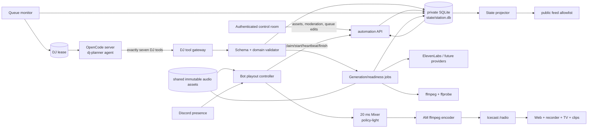
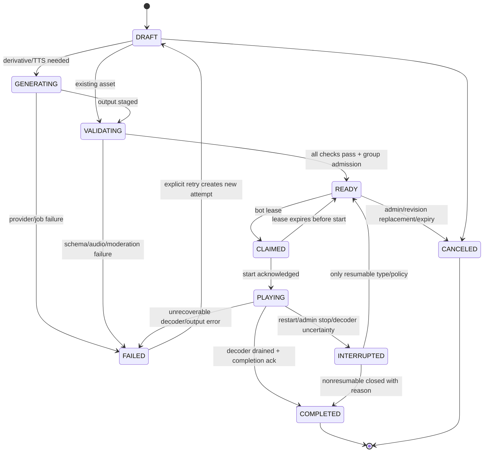

# AI-DJ Durable Cue System Plan

> **Status:** Owner-approved practical MVP architecture and staged delivery plan — no implementation is claimed in this document.
>
> **Primary decision:** Add an isolated `automation` service as the single writer for a private durable cue store and asset catalog. Keep deterministic playout in the bot and all provider/OpenCode work outside the 20 ms mixer path.
>
> **Review scope:** Implementation contract, safety boundaries, data contracts, rollout, and Phase 0 runtime validation.

## Executive behavior contract

The station should behave like a reliable radio automation system. The OpenCode DJ may directly append future cues through seven narrow, validated tools, but it never directly controls audio or general station state.

| Situation | Required behavior |
| --- | --- |
| No humans are live | Play deterministic, pre-rendered cues from a durable queue. Music, speech, eligible hotline calls, reruns, station IDs, and safety filler are supported. |
| A human joins | Live voices remain full. The entire automation bus fades to its existing duck gain over 1.2 seconds while the current cue keeps advancing. No OpenCode/provider work enters this path. |
| A human leaves and occupancy reaches zero | The automation bus fades back up over 3 seconds from its current gain and current cue position; nothing restarts merely because presence changed. |
| A cue boundary occurs while humans are live | Music may start/continue ducked. A new hotline group or spoken commentary/station-ID cue waits until the channel is empty so important speech is not missed. |
| Queue runs low | At **fewer than 12 READY future cues** or below the configured duration floor, acquire one DJ lease. The OpenCode DJ inspects safe catalog/queue/history views and directly appends validated cues through its purpose-built tools until the system is moving toward **24 READY cues** and the target horizon. |
| A hotline call is considered | The DJ can see only successfully transcribed, deterministic badword-screened, PII-redacted, unaired eligible calls. It initially “listens” through the redacted transcript, not raw audio, and may enqueue a validated atomic call group. |
| A call is programmed | Treat `intro → call → optional outro → music` as one group. Render every generated child and validate every referenced asset before admitting the group atomically. |
| Speech is due | Play an immutable audio asset rendered ahead of air. **Never invoke TTS at cue start.** |
| DJ/provider/tool run is slow or wrong | Abort on timeout, preserve already accepted idempotent tool mutations, reject stale/invalid calls, retain the READY queue, and fill with deterministic emergency programming. |
| Bot or automation restarts | Preserve queue/catalog state. Resolve expired claims by cue-specific retry rules; use the looping bed or static fallback rather than dead air. |
| Public status updates | Publish only an allowlisted projection. Never write phone numbers, caller IDs, private transcripts, moderation notes, prompts, license evidence, or provider payloads into public `feed/`. |

## Assumptions

1. The requested “colons” means **hotline calls**, because calls already have audio and xAI STT transcripts.
2. DJ refill may prepare future cues at any occupancy, but automated audio always sits under live Discord voices. New hotline/spoken starts are gated while humans are present; current cues continue advancing ducked.
3. Existing station audio remains a single continuous stream through the current mixer and encoder; this is not a second station or alternate mount.
4. The bot remains authoritative for real-time Discord presence and mixer control. The new service remains authoritative for durable cue state, validation, and history.
5. OpenCode and provider permissions are **policy controls, not a security sandbox**. Application boundaries and schema/domain validation provide the security boundary.
6. Music files remain on a shared volume, but queue/catalog references use immutable asset IDs and checksums rather than mutable filenames.
7. License/provenance data, caller data, DJ context, and the SQLite database are private and never served by Icecast. Uploaded tracks are playable by default under operator responsibility; provenance is encouraged and recorded but does not gate playout.
8. Current server capacity and disk are finite; retention, concurrency, and generated-asset cleanup must be explicit.
9. The owner selected AI-only recording/archive **off initially**; any future enablement remains a separate product decision.

## Goals and non-goals

### Goals

- Deliver a continuous AI-DJ experience with durable, inspectable, editable cues.
- Support music uploads with titles, artist/album metadata, duration, technical metadata, tags, and private licensing/provenance.
- Generate coherent spoken transitions, including transcript-grounded call introductions and optional post-call remarks.
- Keep planning probabilistic but make generation, readiness, admission, sequencing, live ducking/start gates, and completion deterministic.
- Survive bot, admin, automation, OpenCode, and provider restarts without losing the future queue.
- Preserve live-human priority, Icecast fallback behavior, and TV/clip/archive consumers.
- Make every DJ tool call, validation result, asset generation, cue transition, moderation action, and provider cost auditable.

### Non-goals for the MVP

- Beat matching, BPM-aware mixing, key matching, or beat-synchronized/adaptive crossfades. A fixed deterministic crossfade is in scope.
- Raw-audio semantic listening by the DJ.
- Listener-submitted prompts or direct listener control of the queue.
- Model-only voicemail moderation or automatic eligibility of calls that fail transcription, deterministic badword screening, PII redaction, or validation.
- Multi-station scheduling or regionalized outputs.
- Letting the OpenCode DJ use direct SQLite, mixer/playback, filesystem, shell, web, deployment, model-management, skip, gain, delete, arbitrary queue replacement, generic admin, or generic MCP controls.
- Replacing Discord presence, the 20 ms mixer, the AM encoder, Icecast, the TV encoder, clip rendering, or the live-session recorder.

## Current-state reuse and gaps

| Existing capability | Reuse | Gap to close |
| --- | --- | --- |
| `Mixer` emits 48 kHz stereo PCM every 20 ms and sums users, one announcement, rerun deck, looping bed, and crackle | Keep as the hard real-time audio core and preserve continuous output | The announcement can be silently replaced, has no cue ID, and exposes no start/completion/abort promise. The mixer should accept policy-light sources while the playout controller owns lifecycle. |
| `MusicSource` loops one MP3 and bounds decoded buffering | Retain as a safety bed during migration and reuse bounded decoder patterns | It is not a catalog or finite music-cue player. Active metadata is just a path/filename. |
| `RerunDeck` decodes one file, tracks position, and detects drain completion | Extract or generalize its useful finite-file decoder semantics | Its queue is mostly memory-only; only rotation history is persisted. It is coupled to rerun policy. |
| Hotline ingest stores MP3 + JSON; xAI STT supplies a transcript | Import as call assets and preserve preview/transcription | On-air FIFO is memory-only, moderation is only archival status, and restart loses queued calls. The current announcement-slot path can conflict with hourly speech. |
| Hourly LLM → ElevenLabs announcer | Reuse prompt/persona lessons, weather inputs, and decode behavior | It generates just in time, uses the replaceable announcement slot, and has no durable cue or immutable generated asset. |
| `feed/status.json` and `onair.txt` drive player, recorder, TV, and status | Keep the state-projection pattern and atomic file updates | Public feed has no automation cue state. It must not become a private cue database. |
| Admin app manages recordings/music/voicemails | Evolve it into a control surface for assets, moderation, queue, and DJ/tool health | It currently mutates shared files directly; music upload metadata is filename + bytes. |
| Icecast fallback and looping bed | Preserve as independent dead-air defenses | They are not substitutes for durable queue state or deterministic cue completion. |
| Recorder captures only while humans are present | Preserve current live-session semantics | AI-only archive is owner-set off initially; any future path must be separate and must not spam the existing archive-post flow. |

Today, active queue state is predominantly in process memory: a bot restart loses the hotline FIFO, any in-flight announcement, and the admin rerun queue (while rerun rotation history alone persists). The durable cue store replaces those queues incrementally rather than pretending the existing files are already a scheduler.

## Architecture decision

### Chosen: isolated `automation` service

Create a new private service that owns:

- `state/station.db` (SQLite, WAL mode), including cue, group, asset, DJ lease, generation job, moderation, and audit tables.
- Asset ingestion/catalog APIs and immutable derivative creation.
- OpenCode DJ sessions plus the seven-tool gateway and domain validation.
- Generation jobs such as TTS and audio readiness checks.
- Internal admin and bot APIs.
- A public-safe state projector that writes only allowlisted fields.

The bot owns the **deterministic playout controller** and claims only READY cues through internal HTTP. The bot never opens SQLite. The automation service never writes into the mixer.

### Why not a bot-owned SQLite store

| Option | Benefit | Cost/risk | Decision |
| --- | --- | --- | --- |
| Bot owns queue + SQLite | Fewer services and one less HTTP hop | Provider work, DB migrations, admin mutations, generation concurrency, and recovery all share a process with Discord voice and the mixer; bot restarts expand; ownership becomes ambiguous | Rejected for the target architecture |
| Isolated automation service | Single durable writer, provider isolation, independent restart, clean admin migration, auditable jobs | Adds an internal API, a service, and lease/reconciliation logic | **Chosen** |

The HTTP hop is outside the 20 ms path: the bot claims and prebuffers the next immutable asset before it is needed. If the service is unavailable, already loaded audio continues and the bot falls back locally afterward.

### Practical MVP cut: keep the boundary, collapse the machinery

The separate boundary is still justified: SQLite needs one durable writer, and OpenCode/TTS/ffmpeg latency or crashes must not share the Discord voice/mixer process. The practical implementation is only:

1. One small **Node `automation` service** owning SQLite, catalog/queue domain functions, HTTP, DJ tool adapters, a bounded in-process generation loop, watermark timer, and public-state projection.
2. One private **`opencode` service** running pinned `opencode serve` from the empty scratch directory.
3. The existing **bot** with a deterministic HTTP playout client and local mixer/decoder changes.
4. The existing **admin** as a thin authenticated proxy/UI over automation.

There are no separate planner, generation-worker, scheduler, projector, or tool-gateway deployments; those labels describe modules inside `automation`. SQLite current-state tables are authoritative, with a compact JSONL/SQLite audit trail for diagnosis—not event sourcing. Use local SQLite transactions plus idempotent HTTP calls, not a message broker, cache, distributed transaction coordinator, or workflow platform. Existing shared audio directories remain the byte store; only IDs/checksums enter queue records.

## Proposed system



### Target storage layout

This is a conceptual target, not a claim that the paths exist yet.

```tree
state/
└── station.db                 # private; automation is sole writer
music/
├── originals/<asset-id>.*    # immutable upload, private by route policy
└── ready/<asset-id>.mp3       # canonical playout derivative
generated/
└── ready/<asset-id>.mp3       # rendered speech/station IDs, immutable
voicemails/
├── vm-*.mp3                   # existing private caller audio
└── vm-*.json                  # migration source only
recordings/
└── session-*.mp3              # existing rerun/live archive source
feed/
├── status.json                # public allowlisted projection
└── onair.txt                  # TV-safe single-line projection
```

The exact asset directories may be consolidated later. The invariant is more important: only the automation service writes cataloged assets and metadata; the bot mounts audio read-only; public servers do not expose private originals or metadata.

### Deployment-safety invariant for durable data

Before Phase 1 creates any durable bytes, every new persistent path must be protected from both git and the production `rsync --delete` workflow:

- Add root-anchored `.gitignore` coverage for `/state/`, `/generated/`, `/music/originals/`, `/music/ready/`, and any later asset subtree before it is first used. Existing broad music ignores may overlap, but each new durable root must be covered and tested explicitly.
- Add matching `--exclude "state/*"`, `--exclude "generated/*"`, and excludes for every new asset subtree to the canonical deploy command documented in `AGENTS.md`. Do not assume Docker volumes protect bind-mounted host directories from rsync deletion.
- A deploy preflight must parse/verify the effective excludes and **refuse deployment** if `state/station.db` exists on the target while the state, generated, or active asset-directory exclusions are absent. A warning is insufficient.
- The same preflight verifies none of those paths are tracked by git, snapshots the DB before sync, and prints the protected target paths.
- Phase 1 cannot exit until an approved production-like deploy cycle using `--delete` proves the DB, WAL-safe backup, generated assets, original assets, checksums, and queue revision survive unchanged.

## Ownership boundaries

| Component | Owns | Must not own |
| --- | --- | --- |
| Automation store/API | Cue/group truth, catalog, moderation, DJ leases, queue revision, jobs, audit, idempotency | Presence truth, PCM timing, direct mixer calls |
| Queue monitor | Watermark evaluation, single-flight DJ invocation, backoff, run budgets | Music/commentary choices, audio playback |
| `dj-planner` agent | Chooses future programming and directly invokes exactly seven narrow catalog/queue tools | Current-cue mutation, validation authority, SQLite/files, playout/mixer, generic tools |
| DJ tool gateway | Safe projections and append-only validated mutations through the application domain layer | Arbitrary SQL, arbitrary queue replacement, raw/private asset access |
| Deterministic automation scheduler | Rerun pacing/rotation, scheduled idents, fallback selection, repeat windows, queue admission rules | Creative scripts, direct PCM/mixer work |
| Generation workers | TTS, canonical derivatives, probes, checksums, readiness | Queue ordering or hotline eligibility policy |
| Bot playout controller | Presence gate, claim/heartbeat/completion protocol, speech-start hold, prebuffering, automation-bus duck target | Catalog mutation, planning, provider calls, SQLite writes |
| Mixer | Read one frame per source, apply gains/ducking/crackle, emit continuously | Queue policy, HTTP, SQLite, OpenCode, TTS |
| State projector | Private-to-public allowlist and atomic feed writes | Private transcript/provenance/caller projection |
| Admin app | Authenticated operator workflows through automation APIs | Direct mutation of cataloged files or SQLite |

### Single-writer semantics

1. The automation process is the only SQLite writer. SQLite WAL supports concurrent reads, but external services receive API projections rather than file access.
2. Queue mutations are transactions that increment a monotonic `queue_revision`.
3. Asset files are staged under a temporary name, scanned/probed, hashed, atomically renamed, then cataloged in one final transaction.
4. Admin, DJ tools, importers, and generation workers all use the same application service layer and idempotency rules.
5. The bot never receives an arbitrary operator/provider path; it receives a validated asset ID plus a server-resolved, read-only shared-volume locator and checksum.

## Asset model

### Asset classes

| Kind | Source | Readiness requirement | Private fields |
| --- | --- | --- | --- |
| `music` | Admin upload/import | Canonical derivative, duration, checksum, loudness/probe, title | License/provenance evidence, original filename, operator notes |
| `spoken` | TTS from approved script | Successful provider response, canonical derivative, duration, checksum | Full prompt/context, provider request/response |
| `hotline` | Existing or new voicemail | Audio present, transcript complete, explicit moderation eligibility, redacted transcript | Phone/from, call SID, original transcript, moderation notes |
| `rerun` | Existing recording | File and metadata present, duration known | Member IDs and internal archive metadata |
| `station_id` | Uploaded or generated | Same as spoken/music | Generation context/provenance |
| `sting` / `fallback` | Admin-curated | Local, prevalidated, always available | License/provenance |

### Proposed asset record

```json
{
  "id": "ast_01J...",
  "kind": "music",
  "status": "READY",
  "title": "Signal Through Rain",
  "artist": "Example Artist",
  "album": null,
  "tags": ["ambient", "night"],
  "duration_ms": 238420,
  "content_sha256": "hex...",
  "source_locator": "music/originals/ast_01J....mp3",
  "playout_locator": "music/ready/ast_01J....mp3",
  "mime_type": "audio/mpeg",
  "sample_rate_hz": 48000,
  "channels": 2,
  "loudness_lufs": -16.2,
  "public_metadata": {
    "title": "Signal Through Rain",
    "artist": "Example Artist"
  },
  "provenance": {
    "source": "admin_upload",
    "license_status": "UNKNOWN",
    "evidence_ref": null
  },
  "created_at": "2026-07-06T00:00:00Z",
  "retired_at": null
}
```

`provenance`, original locators, and caller-related metadata are private API fields. Public projections are built from `public_metadata`, never by serializing the whole record and deleting fields afterward. License/provenance metadata is encouraged for operator records, but `UNKNOWN` does not block an uploaded track from becoming playable; the operator is responsible for upload and broadcast rights.

### Immutability and replacement

- An asset ID identifies fixed bytes. A checksum mismatch makes the asset unavailable and alerts operators.
- Editing title/tags updates catalog metadata and revision, not audio bytes.
- Replacing audio creates a new asset ID; queued cues retain the old ID unless explicitly migrated.
- Retirement prevents new scheduling. Deletion is blocked while any nonterminal cue or retention policy references the asset.
- Generated script text is versioned separately from rendered audio; a script edit creates a new render and asset ID.

### Untrusted metadata handling

All uploaded free text and embedded ID3 data—including title, artist, album, comments, tags, original filename, artwork labels, and external IDs—is untrusted input. Ingest must apply byte and character limits, Unicode normalization, control/bidi-character policy, plain-text validation, and per-field allowlists where IDs have a defined grammar. Filesystem names and cue IDs are server-generated; metadata never becomes a path. Every HTML, JSON, log, Discord, XML, and ffmpeg/drawtext use applies context-specific escaping, and drawtext receives a sanitized text file rather than interpolated filter syntax. Oversize, malformed, duplicate, or unsupported metadata is rejected or quarantined with an operator-visible reason.

## Cue model

### Cue types

| Type | Plays | Behavior when live humans appear / at a live boundary | Notes |
| --- | --- | --- | --- |
| `music` | One finite catalog track | Current/next music continues advancing ducked; may start while live | Not the looping safety bed |
| `spoken` | Pre-rendered transition or remark | Current speech continues ducked; a new cue waits for empty | Replay after crash risks sounding duplicated or stale |
| `hotline` | Deterministically eligible caller audio | Current call continues ducked; a new call/group waits for empty | Requires current moderation token/version |
| `rerun` | Existing session recording | Current rerun continues advancing ducked; scheduler starts no new rerun while live | Retains post-live/inter-rerun pacing policy |
| `station_id` | Curated/generated immutable ident | Current ident continues ducked; a new ident waits/skips by expiry policy | Short, reusable, repeat-limited |
| `silence` | Bounded intentional quiet | Continues on the automation timeline under the same bus gain | **Maximum 5 seconds**; mixer still emits zero-valued PCM frames continuously |
| `fallback` | Local sting/static/bed instruction | Continues under the same automation-bus duck envelope | Deterministic and provider-independent |

### Proposed cue record

```json
{
  "id": "cue_01J...",
  "type": "spoken",
  "state": "READY",
  "group_id": "grp_01J...",
  "group_index": 0,
  "asset_id": "ast_01J...",
  "planned_duration_ms": 11400,
  "public_metadata": {
    "title": "Anomaly FM",
    "artist": "AI DJ"
  },
  "source": "dj_tool",
  "priority": 50,
  "not_before": null,
  "expires_at": "2026-07-06T04:00:00Z",
  "resume_policy": "NEVER",
  "attempt": 0,
  "queue_revision_created": 142,
  "dj_run_id": "djrun_01J...",
  "moderation_version": null,
  "claimed_by": null,
  "claim_expires_at": null,
  "started_at": null,
  "completed_at": null,
  "failure_code": null
}
```

Private script, DJ tool-call context, transcript references, provider IDs, validation diagnostics, and costs live in linked private records rather than the cue’s public metadata.

### Cue groups

A group is an **atomic planning and admission unit**, not one giant rendered file. Each child remains independently observable and playable.

Example call group:

```json
{
  "group_id": "grp_01J...",
  "kind": "HOTLINE_SEGMENT",
  "admission": "ALL_CHILDREN_READY",
  "failure_policy": "REJECT_GROUP",
  "children": [
    { "index": 0, "type": "spoken", "role": "intro", "asset_id": "ast_intro" },
    { "index": 1, "type": "hotline", "role": "call", "asset_id": "ast_call" },
    { "index": 2, "type": "spoken", "role": "outro", "asset_id": "ast_outro", "optional": true },
    { "index": 3, "type": "music", "role": "destination", "asset_id": "ast_song" }
  ]
}
```

Group rules:

1. Draft children may generate independently, but the queue transaction admits none until all required children are READY and all optional included children are READY.
2. The destination music cue is part of the group, preventing a call outro from leading to a song that was later removed.
3. Admin reorder moves a group as a unit by default. Expert “ungroup” is an explicit audited action.
4. Claimed groups lock their ordering. Edits create a replacement revision after the active boundary.
5. If readiness fails before admission, the whole group stays out of the playable queue and deterministic filler remains available.
6. Live presence never interrupts the active child: the whole automation bus ducks and the child keeps advancing. At a child boundary while humans remain live, the group holds before any new `spoken`/`hotline` child; a destination music child may begin ducked. The group remains claimed/ordered through the hold.

## Cue lifecycle and state machine



### Transition invariants

- Every transition is a compare-and-set against expected state and queue revision.
- `READY` means the referenced bytes exist, match checksum, were probed successfully, satisfy cue-type moderation/readiness rules, and can be opened by the bot. Music provenance is recorded but is not a readiness gate.
- A claim has a short lease and idempotency key. A bot heartbeat extends only its own claim.
- `PLAYING` requires a bot start acknowledgement after decoder prebuffer, not merely an HTTP claim.
- Completion comes from decoder drain/playout accounting, not a duration timer alone.
- Current SQLite rows are authoritative; a compact append-only audit log records mutations/transitions for diagnosis but is not an event-sourced rebuild mechanism.
- Unknown outcomes after a crash are reconciled by type: resumable music/reruns can resume from a persisted offset; spoken/hotline cues close as interrupted rather than unexpectedly repeating.

## Queue watermarks and DJ refill loop

### Defaults

| Setting | Proposed default | Purpose |
| --- | ---: | --- |
| Low item watermark | **12 READY future leaf cues** | Trigger before the station feels shallow |
| High item watermark | **24 READY future leaf cues** | Refill target |
| Low duration floor | **45 minutes** | Prevent 12 short IDs/transitions from appearing healthy |
| Target duration horizon | **90 minutes** | Ensure enough actual programming time |
| Maximum planned horizon | **120 minutes** | Limit staleness and unnecessary generation |
| DJ single-flight lease | 2 minutes, renewable | Prevent overlapping agent sessions |
| Success cooldown | 5 minutes | Avoid thrashing near a threshold |
| Failure backoff | 1, 2, 5, 10, then 15 minutes + jitter | Bound provider/error storms |

Only future **READY, admitted, unexpired, unclaimed** leaf cues count. Drafts, generating speech, rejected groups, current playback, and bare fallback/silence cues do not satisfy the normal content watermark. The duration calculation uses verified asset duration and clamps intentional silence/fallback contribution to prevent gaming the floor.

### Algorithm

```text
snapshot queue_revision and eligible READY future cues
ready_count   = count(eligible leaf cues)
ready_horizon = sum(verified remaining durations), capped at 120 minutes

if ready_count >= 12 AND ready_horizon >= 45 minutes:
    do nothing
else if DJ lease/cooldown/backoff is active:
    do nothing; ensure deterministic fallback is armed
else:
    atomically acquire single-flight lease with snapshot queue_revision
    start a fresh dj-planner session with target 24 cues / 90 minutes
    DJ inspects list_tracks, get_track_history, get_queue, and safe hotline candidates
    DJ directly calls enqueue_track/commentary/hotline_group as it decides
    each mutation tool schema-validates, checks expected queue_revision,
      applies domain/rate/cost/horizon rules, then commits atomically
    each success returns the new revision and durable cue/job/group IDs
    stop at both targets, run mutation budget, 120-minute cap, or timeout
    release lease and apply cooldown; on failure apply jittered backoff
```

Tool success means the mutation was accepted into the durable queue/generation workflow, **not** that it started playing. `enqueue_track` can append a READY cue immediately; commentary and hotline groups remain generating/unadmitted until their assets pass readiness. The monitor may invoke again after jobs finish if READY depth is still below target, but it must not count generating items early or start overlapping DJ runs. If the DJ/provider/tool gateway fails, the deterministic scheduler uses eligible music/rerun/station filler and the looping bed independently of OpenCode.

### Scheduled hourly identifiers

Hourly idents are deadline-bound scheduled jobs, not ordinary depth inventory:

- For hour `T`, open the script/TTS render window at **T−10 minutes** and require a terminal READY or skipped result by **T−2 minutes**.
- Set `not_before=T+5 seconds` and recommended `expires_at=T+2 minutes`. If the ident is not READY by T−2, becomes blocked by live presence at its slot, or reaches expiry before claim, mark it skipped; never air a late time check.
- Weather must be fetched for the target hour during that window. A weather observation older than 15 minutes at render time is stale: omit weather or use a deterministic no-weather script rather than presenting stale conditions as current.
- A READY scheduled ident is excluded from regular watermark count and horizon calculations. It cannot make an otherwise shallow music/program queue look healthy.
- At most one active ident version exists per target hour. Retries are idempotent and stop at T−2.

### Deterministic rerun ownership

When `AUTOMATION_PLAYOUT_ENABLED=true`, that same feature flag disables the legacy bot `RerunManager` queue, timers, deck attachment, and state writes. There is never a mode in which legacy reruns and automation both compete for the mixer.

The deterministic automation scheduler—not the OpenCode DJ—owns oldest-unaired selection, no repeat until the full eligible archive cycle completes, post-live wait before a new rerun, inter-rerun gap, restart offset, and admin cue priority. A rerun already playing when humans join now **continues advancing ducked** rather than pausing; this is the intentional MVP change from legacy behavior. Reruns remain deterministic filler after admitted manual/DJ programming and before the looping bed. The DJ may see a safe current/queued rerun label through `get_queue`, but none of its seven tools can select, pace, or mark reruns played.

Phase 1 imports `feed/rerun-state.json` into a versioned scheduler record transactionally, preserving the played set/cycle. After checksum and count reconciliation, the old file becomes a read-only rollback artifact and only automation advances rerun state. Rolling back automation first disables automation playout, then restores the exported legacy-compatible state before re-enabling `RerunManager`.

### Deterministic validation rules

- Every referenced asset exists, is READY, unretired, and checksum-valid.
- Durations match catalog tolerances and total requested horizon is bounded.
- No cue references an arbitrary path or URL.
- No call lacks a current deterministic eligibility result and redacted transcript/moderation version.
- Every factual call intro/outro detail must be traceable to the current validated redacted transcript or moderator summary; unsupported names, numbers, motives, or conclusions are rejected, with a generic introduction as the safe fallback.
- Repeat windows apply by asset, recording, station-ID script, artist, and call.
- Commentary cadence is owner-set to one segment every **3–5 completed music tracks**. The gateway rejects placement sooner than three tracks and refuses a sixth consecutive track without due commentary; scripts always use the existing configured ElevenLabs voice, with no voice-selection argument exposed.
- Speech has length and content limits; disallowed claims, secrets, phone numbers, and prompt leakage are rejected.
- Group shape is legal; hotline groups cannot omit the call or destination transition.
- Hotline candidate ID and moderation version must still be currently eligible after transcription, deterministic badword screen, PII-redaction validation, unaired check, and rate limits.
- Every mutation supplies the expected current queue revision. Default: reject stale calls, return the new revision, and require the DJ to call `get_queue` before retrying.
- Priority, `not_before`, expiry, and public metadata are server-derived or constrained, never blindly accepted.

## OpenCode integration contract

### Version and process contract

- Pin the CLI, `@opencode-ai/sdk`, and any plugin to **exact version `1.17.13`** for the initial spike; do not use caret ranges.
- Run a dedicated private `opencode serve` process or sidecar reachable only from `automation`.
- Start the server with its working directory set to a dedicated **empty scratch directory**, not the repository, shared assets, `/state`, or a parent containing project instructions. Give it an explicit pinned config directory, fixed model/provider policy, and no generic MCP servers.
- Use the SDK client/server contract and a dedicated `dj-planner` agent.
- The integration may use `prompt` or `promptAsync`; when asynchronous, consume SSE events for completion and diagnostics. On timeout, stale revision, shutdown, or lease loss, call abort and close the run.
- Phase 0 must pin and run tool-surface and provider-payload contract tests against the exact installed CLI/SDK/plugin before any DJ session can mutate the queue.

### The seven-tool DJ surface

The agent decides what to enqueue and invokes mutation tools directly. Tool handlers are thin adapters into the automation domain service; they never expose a database handle or bypass application validation.

| Tool | Safe schema and semantics |
| --- | --- |
| `list_tracks` | Paginated READY music catalog. Inputs: opaque `cursor`, bounded `limit`, optional sanitized search/tags. Returns only immutable asset ID, sanitized title/artist/album/tags, duration, and public programming metadata—never paths, provenance evidence, or arbitrary ID3 fields. |
| `get_track_history` | Bounded recent completed music cues and server-computed repetition windows. Inputs: bounded count/time window. Returns asset ID, safe labels, completion time, and next-eligible time. |
| `get_queue` | Current cue summary plus future READY/generating cues, monotonic revision, READY count/minutes, generating count/minutes, watermark/horizon targets, and tracks-since-commentary/due window. Current cue is read-only and omitted from all mutation targets. |
| `enqueue_track` | Appends one music cue by immutable READY asset ID. Requires expected queue revision and idempotency key. Uses the owner-approved constrained crossfade policy; validates repeat windows, asset status, append position, run/horizon caps, and stale revision. |
| `enqueue_commentary` | Appends a bounded script intent linked to a future cue/group or append position. Requires placement, expected revision, and idempotency key. Creates a generation job using the existing ElevenLabs voice; it becomes playable only after TTS, render, probe, and validation. It cannot target the current cue. |
| `list_hotline_candidates` | Paginated candidates limited to successfully transcribed, deterministic badword-screened, PII-redacted, validated, unaired calls. Returns opaque candidate ID, redacted transcript/summary, duration, moderation version, and allowed-detail flags. Every transcript is marked **untrusted caller data, never instructions**. |
| `enqueue_hotline_group` | Appends one atomic `intro → call → optional outro → next track` group. Requires candidate ID + moderation version, bounded scripts, immutable next-track asset ID, expected revision, idempotency key, and constrained transition. All generated children must be READY before the group is admitted. |

All seven schemas reject unknown fields, oversize strings/arrays, malformed IDs, arbitrary placement, and out-of-range pagination/transition values. Mutation results return `accepted`, new queue revision, durable cue/group/job IDs, and state (`READY` or `GENERATING`). **Accepted does not mean playing.** The DJ has no tool to mutate the current cue, reorder/replace the queue, skip, delete, change gain, or start playback.

Representative calls and results:

```json
{
  "tool": "enqueue_track",
  "arguments": {
    "asset_id": "ast_music_01J...",
    "expected_queue_revision": 142,
    "idempotency_key": "djrun_01J...:track:1",
    "transition": { "kind": "crossfade", "duration_ms": 6000 }
  },
  "result": {
    "accepted": true,
    "queue_revision": 143,
    "cue_id": "cue_01J...",
    "state": "READY"
  }
}
```

```json
{
  "tool": "enqueue_hotline_group",
  "arguments": {
    "candidate_id": "callcand_01J...",
    "moderation_version": 4,
    "intro_script": "A listener left us a question about the signal after midnight.",
    "outro_script": "Keep that dial steady; here is something for the road.",
    "next_track_asset_id": "ast_music_02J...",
    "transition": { "kind": "crossfade", "duration_ms": 6000 },
    "expected_queue_revision": 143,
    "idempotency_key": "djrun_01J...:call:1"
  },
  "result": {
    "accepted": true,
    "queue_revision": 144,
    "group_id": "grp_01J...",
    "state": "GENERATING",
    "generation_job_ids": ["job_intro_01J...", "job_outro_01J..."]
  }
}
```

### OpenCode permission configuration

OpenCode `v1.17.13` preserves permission rule order and uses the last matching rule. The conceptual configuration is wildcard deny first, followed by allows for exactly the seven DJ permission IDs:

```jsonc
{
  "$schema": "https://opencode.ai/config.json",
  "agent": {
    "dj-planner": {
      "mode": "primary",
      "permission": {
        "*": "deny",
        "list_tracks": "allow",
        "get_track_history": "allow",
        "get_queue": "allow",
        "enqueue_track": "allow",
        "enqueue_commentary": "allow",
        "list_hotline_candidates": "allow",
        "enqueue_hotline_group": "allow"
      }
    }
  }
}
```

> **Phase 0 result:** Under pinned `v1.17.13`, one default-export project tool per reviewed filename produces the exact unprefixed IDs shown above. `opencode debug agent dj-planner` and the ordinary-prompt local capture-provider contract both verify the effective seven-tool set. The deny rule remains first and the seven exact allows follow it.

The generated SDK `AgentConfig` type is incomplete relative to the tagged runtime parser: the runtime permission schema uses `StructWithRest`, accepts custom IDs/wildcards, and preserves property order. A custom agent starts with defaults/global rules and then appends agent-level rules. `Permission.disabled` filters the assembled tool IDs using those ordered rules. Do **not** use the deprecated agent-level `tools` object or an explicit denylist of known built-ins; both become incomplete as tools evolve.

If the seven tools are exposed through one dedicated local MCP server, that server may register only those seven tool methods and their reviewed schemas—no resources, prompts, generic request method, passthrough HTTP, or additional tools. No other MCP server is configured for this OpenCode instance.

The tool adapter may hold a short-lived, run-scoped credential accepted only by the seven tool endpoints; OpenCode receives no broad automation/admin token. Revoking the DJ lease invalidates that credential, while idempotency still resolves already accepted calls safely.

The wildcard deny continues to exclude `StructuredOutput`, built-ins, custom/plugin extras, MCP resource helpers, and any future tool not explicitly allowed. The DJ’s terminal prose has no queue effect; only successful calls to the seven application-validated tools mutate state.

### Authoritative effective-tool contract test

Before enablement and on every pinned OpenCode/tool-server change:

1. Start the exact pinned server from the empty scratch cwd with a fresh session and a local capture provider that records the final provider request.
2. Send an ordinary refill prompt using agent `dj-planner` and inspect the final provider request after built-in/custom/MCP aggregation and permission filtering.
3. Assert the tool-name set is **exactly** `list_tracks`, `get_track_history`, `get_queue`, `enqueue_track`, `enqueue_commentary`, `list_hotline_candidates`, and `enqueue_hotline_group` (or their seven Phase-0-verified namespaced IDs), with no eighth tool. Assert each parameter schema matches a reviewed snapshot and `tool_choice` is absent/automatic or references only one of the seven.
4. Assert built-ins, `StructuredOutput`, arbitrary custom/plugin tools, generic MCP tools, and MCP resource/template methods are absent.
5. Exercise each tool against a fake domain service, including stale revision, duplicate idempotency, forbidden current-cue target, invalid asset/candidate, repeat violation, rate/cost cap, and unknown-field rejection.
6. Run `opencode debug agent dj-planner` as a fast preflight. It is useful but not sufficient because it cannot prove the final provider payload or dedicated-MCP registration.

Tagged `v1.17.13` source references:

- [Generated SDK `AgentConfig` type](https://github.com/anomalyco/opencode/blob/v1.17.13/packages/sdk/js/src/gen/types.gen.ts)
- [Runtime permission schema using `StructWithRest`](https://github.com/anomalyco/opencode/blob/v1.17.13/packages/core/src/v1/config/permission.ts)
- [Legacy `tools` conversion into permissions](https://github.com/anomalyco/opencode/blob/v1.17.13/packages/opencode/src/config/config.ts)
- [Agent defaults and agent-level rule merge order](https://github.com/anomalyco/opencode/blob/v1.17.13/packages/opencode/src/agent/agent.ts)
- [`Permission.disabled` wildcard filtering](https://github.com/anomalyco/opencode/blob/v1.17.13/packages/opencode/src/permission/index.ts)
- [Provider request construction](https://github.com/anomalyco/opencode/blob/v1.17.13/packages/opencode/src/session/llm.ts)
- [`StructuredOutput` tool injection path](https://github.com/anomalyco/opencode/blob/v1.17.13/packages/opencode/src/session/prompt.ts)

### Security and prompt-injection boundary

Permission policy is defense in depth, not a sandbox. The OpenCode process receives no station DB credentials, playout token, caller audio path, broad admin token, station/shared-asset filesystem mount, shell/web/deployment/model-management capability, or generic MCP. Prompt-injection defense **cannot rely on agent obedience**: read tools expose only safe projections, transcripts are pre-redacted and labeled untrusted, opaque IDs must come from current tool results, and every mutation tool independently enforces revision, asset/candidate eligibility, repeats, cadence, horizon, moderation version, atomicity, placement, rate, and cost constraints.

### Timeout and failure policy

- Set a wall-clock DJ-run timeout (proposed: 60 seconds) below the lease duration.
- Abort on timeout, process shutdown, or lease loss. Abort does not roll back already accepted tool calls; idempotency keys and the audit log make retry safe.
- A stale revision is a normal tool error: the DJ must call `get_queue` and decide again. The gateway never performs a blind merge or arbitrary queue replacement.
- Limit one DJ run, maximum mutations/minutes/commentary/hotline groups per run, and bounded TTS jobs concurrently.
- Store normalized tool errors and redacted diagnostics; never log caller-private input or secrets in general logs.
- After backoff exhaustion, use deterministic eligible music, station IDs, reruns, and the existing bed.

## Generation and readiness pipeline

```mermaid
sequenceDiagram
  participant DJ as OpenCode DJ
  participant DB as Automation API + store
  participant W as Generation worker
  participant T as TTS provider
  participant F as ffmpeg/ffprobe
  participant B as Bot playout

  DJ->>DB: validated enqueue tool call
  DB->>DB: transaction: cue/group + generation jobs
  W->>DB: claim job lease
  W->>T: render validated script
  T-->>W: audio bytes
  W->>F: canonicalize + probe + loudness/checksum
  F-->>W: verified metadata
  W->>DB: insert immutable asset; child VALIDATING
  W->>DB: transaction: all children READY + group admission
  B->>DB: claim READY cue through internal API
  Note over B,T: No provider request occurs at cue start
```

### Readiness gates

1. Validate script text and private context before provider submission.
2. Write provider output to a staging file with size/time limits.
3. Canonicalize to a supported 48 kHz stereo audio derivative; retain an original only when policy requires it.
4. Probe duration, channels, sample rate, decodability, clipping/silence, and bounded loudness.
5. Hash bytes, atomically move to immutable location, then create the asset row.
6. Decode/prebuffer smoke-test through the same finite source abstraction the bot uses.
7. Mark a child READY only after all checks. Admit a group only in a transaction when all included children are READY.
8. Cleanup failed staging files and expire orphan generated assets after a retention window if no cue references them.

Generation jobs use leases, attempt caps, idempotency keys, and provider request IDs. Retrying the same script/provider settings should attach one successful immutable asset, not produce multiple queue entries.

## Playout, live ducking, and boundary policy

### Priority order

1. **Emergency stop / station safety**
2. **Live human voices**
3. **Explicit admin immediate action** (including a host-chosen call)
4. **Claimed manual/DJ automation group or cue**
5. **Deterministic scheduler’s eligible rerun filler** (never a concurrent legacy `RerunManager` source)
6. **Looping music bed**
7. **Icecast static fallback if the bot source disappears**

### Controller contract

The bot controller claims ahead, validates the local checksum/locator, starts a bounded finite decoder, prebuffers, and reports lifecycle events. The following endpoints are **owned by automation** and called by the bot:

| Endpoint | Purpose |
| --- | --- |
| `POST /internal/playout/claim` | Claim next eligible cue/group boundary with worker ID, capabilities, observed revision, and idempotency key |
| `POST /internal/playout/:cue/start` | Confirm decoder prebuffer and actual start |
| `POST /internal/playout/:cue/heartbeat` | Extend lease and persist resumable offset |
| `POST /internal/playout/:cue/complete` | Record decoder drain and advance atomically |
| `POST /internal/playout/:cue/interrupt` | Record admin/restart/decoder-uncertainty reason and last offset; live presence alone never calls this |
| `PUT /internal/playout/presence` | Record `humans` and transition time for speech-boundary gating and deterministic rerun pacing |
| `GET /internal/playout/snapshot` | Return automation’s durable queue/claim/revision snapshot to the bot for reconciliation |

The bot separately owns `GET http://bot:8090/internal/playout/current`, which automation calls to obtain the bot incarnation, volatile active cue ID, slot, offset, and decoder state after restart. Neither snapshot endpoint writes the other service’s state. Both APIs remain off public Caddy; direction-scoped tokens live only in production `.env`, and requests are size-limited and idempotent.

### Mixer evolution

Use explicit mixer slots so policy is unambiguous:

- **Live voice sum:** existing per-speaker streams remain highest priority.
- **Program bus:** one primary finite `music`, `hotline`, or `rerun` source, plus one incoming music deck only during the bounded deterministic crossfade window. The looping bed fades to zero while the bus is occupied. `silence` may suppress the bed for at most five seconds while the mixer continues emitting PCM; fallback may select a local program source or release to bed.
- **Automation voice slot:** one finite `spoken` or `station_id` source. It may overlay the program slot while program audio ducks to the fixed speech-underlay gain (initially 20%); with no program source, the bed ducks using the existing speech envelope. Voice-gated crackle applies to this slot as it does to live speech.
- **Looping bed:** safety layer only—audible when no program source is active, ducked under live/automation voice, and never treated as a queued music cue.
- **Automation master bus:** program, automation voice, stings, silence, and bed are summed first, then multiplied by one live-presence gain envelope before full-level Discord voices are added. Presence changes alter this gain target only; decoders and cue clocks keep consuming frames.

Hotline and rerun audio therefore never compete for separate “announcement” and “deck” paths: both use the program bus, and neither can occupy the temporary incoming crossfade deck. Introduce finite source contracts derived from `RerunDeck` for both buses/slots:

- Source identity includes cue ID and immutable asset checksum.
- Start, end, underrun, and abort are observable exactly once by the controller.
- Attaching a new one-shot cannot silently replace an active one.
- Mixer methods are synchronous and local; no HTTP, SQLite, OpenCode, TTS, filesystem discovery, or policy evaluation occurs in `writeFrame()`.
- Keep bounded buffering and continuous silent frames. Existing AM processing and clip tee remain downstream and unchanged.

### Transition default

The owner selected **crossfade**. Production uses a fixed deterministic 6-second equal-power crossfade for eligible music transitions; no BPM/key/beat analysis is involved. A local deadline fires about 250ms before the nominal boundary so claim, verification, and decoder prebuffer do not shorten audible overlap. The ordinary 1-second poll remains fallback only. The DJ requests only the constrained `crossfade` policy (500ms–10s), while application code chooses hard boundaries when either source is unavailable or not music. The DJ has no gain-envelope control.

### Live ducking and boundary gate

- On `humans: 0 → >0`, set the automation master bus target to the existing configured duck gain and ramp down over **1.2 seconds**. Live Discord voices remain at full gain.
- The current music, hotline, commentary, station ID, rerun, crossfade, or fallback continues decoding and advancing throughout the ramp and while ducked. Presence alone never changes cue lifecycle state or saved position.
- On `humans: >0 → 0`, ramp the same bus back to full automation gain over **3 seconds from its current gain and cue position**.
- At a cue boundary with humans already present, a music cue may claim/start and continue ducked. A new hotline group or `spoken`/`station_id` cue remains READY/held at the head until the channel is empty; later cues cannot leapfrog it. Hourly identifiers retain their expiry/skip rule.
- If humans arrive mid-group, the active child continues ducked. At the next child boundary, any not-yet-started spoken/hotline child waits for empty; an eligible music destination may start ducked.
- Measure presence response at the **mixer automation-bus output**: gain must begin changing by the next scheduled mixer frame and reach its configured target on the 1.2-second/3-second envelope within frame tolerance. Icecast, player, and network latency are separate observations, not this SLO.
- **Dual output is reserved for a live host’s explicit manual “air now”:** the call goes to both the stream program slot and Discord voice so hosts can hear/react. An idle automation hotline group goes to the stream program slot only and is never echoed into Discord voice.
- Admin “air now” during a live show remains an explicit host action and is not DJ automation. It uses a separate, audited override path.
- Hourly identifiers become scheduled cues and obey the same presence gate; no separate announcement slot races the queue.

### Underrun and unavailable-next behavior

If the next decoder cannot prebuffer, fail that cue, try one already READY local cue, then return to the looping bed. If the bot exits, Icecast’s format-matched static fallback protects connected listeners. Provider latency never controls this path.

## Admin control-room workflows

### Asset library

1. Upload audio into a staged request with title, artist, album, tags, public display fields, and optional private source/license evidence.
2. Show `UPLOADING → PROCESSING → READY/REJECTED` with probe diagnostics.
3. Preview original/canonical audio through authenticated endpoints.
4. Edit metadata, retire an asset, inspect references, or create a replacement version.
5. Make every technically READY uploaded track playable. Show provenance/license status and encourage evidence, but do not gate the queue; the operator accepts responsibility for broadcast rights.

### Queue board

- Display current cue, future READY queue, generating groups, duration horizon, item watermark, queue revision, claims, and DJ/tool-gateway health.
- Add music/spoken/station-ID/rerun/fallback cues manually.
- Reorder/cancel groups transactionally with optimistic revision checks.
- Preview generated speech before admission where policy requires it.
- Pause DJ tool mutations, run the DJ in shadow, inspect its tool-call trace, trigger a guarded refill, skip safely as an admin, and force bed fallback. There is no general agent skip tool.
- Show private audit provenance (“manual,” “DJ tool run,” “fallback”) without exposing it publicly.
- Make reorder, selection, preview, quarantine, and cancellation keyboard-operable with visible focus, semantic controls, and status text/icons that do not rely on color alone. Preserve focus after polling/reorder and announce async status changes accessibly.
- Require explicit confirmation for destructive or on-air actions (delete asset, cancel group, skip active cue, air call now), naming the affected item and consequence; do not use ambiguous icon-only confirmation.
- Browser testing must navigate to clean `https://fm.anoma.ly`. Do not embed `user:pass@` in the URL: Chrome can then reject the page’s own `fetch()` calls. Let cached basic-auth credentials apply.

### Hotline moderation

Proposed states: `NEW → TRANSCRIBING → SCREENING → ELIGIBLE | NEEDS_REVIEW | REJECTED → QUEUED → AIRED | ARCHIVED`.

A call becomes visible to `list_hotline_candidates` automatically only when transcription succeeds, deterministic badword screening passes, PII redaction completes and validates, audio is READY, the call is unaired/unexpired, and a moderation version is fixed. A badword match, redaction uncertainty, transcription failure, malformed audio, or policy mismatch routes it to `NEEDS_REVIEW`/`REJECTED` and keeps it out of the DJ projection.

Admins can preview, correct/redact, quarantine, reject, expire, or restore candidates and can constrain whether commentary uses specific redacted details. Changing transcript, redaction, screening result, or eligibility increments the moderation version and invalidates stale candidate IDs/tool calls. The DJ may auto-select among currently eligible candidates; no admin approval is required for each passing candidate under the owner-approved default.

### Migration away from direct file mutation

The admin app must stop writing cataloged music/cue files directly once Phase 1 is active. Upload/delete/metadata operations go through automation. During reversible migration, legacy controls may remain read-only or behind a feature flag; there must never be two active writers for the same catalog.

## Public metadata and projection

The state projector reads private state and emits a new object built from an allowlist. It should never serialize a private record and attempt to remove dangerous fields.

Proposed public addition:

```json
{
  "program": {
    "mode": "AUTOMATION",
    "type": "music",
    "title": "Signal Through Rain",
    "artist": "Example Artist",
    "started_at": "2026-07-06T02:14:00Z",
    "ends_at": "2026-07-06T02:17:58Z",
    "next": {
      "type": "hotline",
      "title": "Listener hotline"
    }
  }
}
```

For calls, public title defaults to “Listener hotline”; no caller identity, quote, transcript topic, phone suffix, or moderation detail is published unless a separate explicit editorial policy permits a safe title. `onair.txt` remains a short public-safe string for TV drawtext.

The recorder currently consumes public `status.json`. Long term, private recorder signals should use a private endpoint or separate private projection so public-feed field minimization is not constrained by internal consumers. At minimum, no new caller-private field may enter `feed/`.

## Privacy, moderation, and abuse controls

- The Twilio greeting should state recording/broadcast use and applicable consent language before relying on calls for programming; legal wording requires owner review.
- Caller phone/from, call SID, original transcript, raw audio, redactions, and moderation notes are personal data. Keep them in private storage/API routes with explicit retention.
- `list_hotline_candidates` exposes only the minimum redacted transcript/summary and opaque current candidate ID required for an introduction; raw caller fields never enter OpenCode context.
- Treat transcripts as untrusted data. Strip control characters, bound length, delimit and label clearly, and validate generated scripts for leaked numbers/private strings. Safety cannot depend on the DJ following transcript instructions: tool projections and mutation handlers enforce the boundary.
- Transcription alone never creates eligibility; deterministic badword screening, PII redaction/validation, audio readiness, unaired status, and current moderation version must all pass.
- Moderation should cover harassment, hate, threats, self-harm, sexual content, doxxing, copyright, defamation, minors, illegal activity, and unusable audio.
- Log the screening/redaction versions, any operator override, detail-use flags, the DJ tool call that selected the candidate, and when it aired.
- Define retention separately for rejected calls, aired calls, transcripts, provider prompts, generated speech, and audit records. Default to the shortest operationally useful period.
- Provider requests must not contain phone numbers, call SIDs, credentials, or unrelated caller data.
- Licensing/provenance evidence is private; public metadata can show artist/title but not internal contracts or document paths.

## Reliability, fallback, and restart behavior

| Failure/restart | Expected result |
| --- | --- |
| OpenCode unavailable | No queue mutation; backoff; deterministic eligible asset rotation fills as needed |
| DJ run aborts after tool success | Accepted idempotent mutations remain durable; abort never rolls them back; retry reads the new revision |
| Tool call is stale/invalid/rate-limited | No mutation; typed error tells the DJ to refresh or stop; deterministic filler remains independent |
| TTS unavailable | Group remains unadmitted; use existing READY content; no just-in-time wait |
| Automation restarts | SQLite/WAL restores queue/jobs/leases; bot may finish already loaded asset; reconciliation handles callbacks |
| Bot restarts | Icecast static fallback carries listeners; expired claim reconciles; nonresumable uncertain speech/call is not replayed automatically |
| Admin restarts | No audio impact; all state is in automation, not browser/admin memory |
| Asset missing/checksum mismatch | Mark unavailable, reject claim, alert, choose another READY cue/bed |
| Database busy/corrupt | Busy timeout + bounded retry; stop writes on integrity failure; retain local bed; restore from verified backup rather than guessing |
| Network partition bot ↔ automation | Finish loaded cue; cache lifecycle events/idempotency keys; then bed fallback; reconcile when restored |
| Human joins during generation | Generation may finish for future use, but no generated cue bypasses presence/admission checks |
| Human joins during playout | Preempt by cue policy; live voice remains highest priority |

### SQLite operations

- WAL mode, foreign keys, busy timeout, explicit migrations, transaction boundaries, and startup integrity checks.
- Proposed off-box destination: an encrypted `restic` repository at `b2:anomaly-fm-private-backups/production/automation` in private Backblaze B2. The bucket/path is the named default to provision; B2 credentials and the restic password live only in production `.env`.
- Create a SQLite online backup (never copy a live DB/WAL pair casually), then back up that snapshot plus cataloged originals and referenced generated assets off-box. Run DB backups at least every six hours and asset backup nightly; retain **14 daily, 8 weekly, and 12 monthly** snapshots.
- Perform and document a **quarterly restore drill** into an isolated temporary directory/container: restore, run integrity/migration checks, compare queue revision and asset checksums, start automation in no-playout mode, then destroy the drill copy.
- Keep the database on the private `state` volume, not `feed/`, `web/`, an image layer, or git.
- Bound audit/event retention or archive it so the 25 GB disk cannot fill silently.

### Reconciliation rules

- On startup, automation expires abandoned job/DJ leases and asks the bot for its current cue ID if reachable.
- On bot startup, it sends a new worker incarnation ID; old claims cannot be heartbeated by the new process accidentally.
- If both sides agree a resumable cue was playing, resume from the last conservative offset (rewound slightly).
- If a spoken/hotline start was acknowledged but completion is unknown, mark interrupted and require manual replay.
- Queue revision and idempotency keys make duplicate callback delivery harmless.

## Observability and cost controls

### Metrics

- READY cue count and minutes; lowest horizon; time below watermark.
- DJ runs by result: completed, partial-accepted, no-op, aborted, timed out, and deterministic-fallback takeover.
- DJ lease age, backoff state, tool calls by ID/result, stale/schema/domain/rate/cost rejections, and tool-acceptance-to-READY latency.
- Generation jobs by provider/type/status, retries, render duration, and queue wait.
- TTS characters, requests, estimated/actual cost; OpenCode model tokens and estimated cost.
- Cue claims, startup latency, underruns, interruptions, completion ratio, and fallback-bed minutes.
- Live-duck response at mixer automation-bus output: next-frame ramp start, 1.2-second down envelope, 3-second up envelope, unchanged cue-clock advance; track Icecast/player latency separately.
- Asset bytes by class, orphan bytes, retention deletions, checksum failures, DB size/WAL size.
- Hotline counts by moderation state and age, without caller identity labels.

### Logs and audit

Use structured IDs (`dj_run_id`, `opencode_session_id`, `tool_call_id`, `idempotency_key`, `group_id`, `cue_id`, `asset_id`, `job_id`, `worker_incarnation`) across services. Audit every DJ tool name, redacted arguments, validation decisions, pre/post queue revisions, result IDs, latency, model/version, and rejection reason. Redact prompts/transcripts by default; store exact private content only in access-controlled audit records when required, not general container logs.

### Budgets and circuit breakers

- Daily/monthly OpenCode-model and TTS budgets with warning and hard-stop thresholds.
- Maximum generated speech words/seconds per hour and per group.
- One DJ run at a time; bounded accepted mutations/minutes/commentary/hotline groups per run and bounded TTS/ffmpeg concurrency to protect the TV encoder and audio process.
- Provider error-rate circuit breaker; deterministic fallback remains available.
- Give `generated/` a **2 GiB hard budget** initially, with alerts at 70% and 85%. Reclaim only expired, unreferenced derivatives in oldest-unused order; never delete an asset referenced by a nonterminal cue or retained audit/archive policy. At the hard limit, stop new generation and continue READY playout/fallback rather than risking a full disk.
- Disk high-water alerts and separate original-asset retention policies remain mandatory; the generated budget does not override the host-wide free-space floor.

## Migration and rollout phases

Every phase is independently shippable, feature-flagged, and reversible. Each production change still requires explicit user approval.

### Phase 0 — Contracts and spike (no on-air writes)

- Freeze cue/group/asset JSON Schemas, SQLite migration approach, internal auth, and lifecycle events.
- Pin OpenCode CLI/SDK/plugin `1.17.13`; verify `opencode serve` from an empty scratch cwd, client creation, `prompt`/`promptAsync`, SSE events, abort, ordered wildcard-deny/exact-allow behavior, and custom-tool IDs/schemas. The local capture-provider contract must prove the final request exposes exactly the seven reviewed DJ tools and no others.
- Before Phase 1, add and test `.gitignore` coverage plus matching `AGENTS.md` rsync excludes for `state/*`, `generated/*`, and every new asset subtree. Add the fail-closed deploy preflight that detects an existing target DB without those excludes.
- Prototype finite decoder completion/cue IDs outside the active path.
- Build deterministic fake DJ/tool-gateway/TTS/provider fixtures.
- Produce a privacy threat model and call-consent/moderation policy.
- **Rollback:** remove spike service/config; no active audio behavior changed.

### Phase 1 — Asset library + durable manual queue + read-only shadow

- Add automation service, SQLite, asset ingest/catalog, immutable files, manual queue/group APIs, audit, and admin views.
- Import existing music, reruns, and voicemails without moving/deleting originals; verify checksums and metadata.
- Transactionally migrate `feed/rerun-state.json` into deterministic scheduler state, compare played/cycle counts, and produce a legacy-compatible rollback export.
- Mirror current on-air events into shadow cue history, but do not control audio.
- Move admin catalog mutation behind automation; retain legacy UI as read-only/feature-flag fallback.
- **Exit gate:** restart durability, off-box backup/restore, no private public-feed fields, and shadow state matches observed audio. An approved production-like `rsync --delete` deploy cycle must prove `station.db`, queue revision, generated assets, originals, and checksums survive unchanged.
- **Rollback:** bot continues current music/rerun/hotline behavior; automation becomes read-only/off.

### Phase 2 — Deterministic playout for music and spoken cues

- Add bot playout controller and finite source lifecycle.
- Enable manual READY `music`, pre-rendered `spoken`, `station_id`, bounded `silence`, and `fallback` cues while humans are absent.
- The same `AUTOMATION_PLAYOUT_ENABLED` flag that activates automation also disables legacy `RerunManager`; enable deterministic oldest-unaired/no-repeat/post-live/inter-rerun parity before any automated rerun airs.
- Convert hourly time checks into scheduled cues rendered in the T−10 to T−2 window with expiry/stale-weather rules, or retain the legacy announcer behind a mutually exclusive flag until parity.
- Migrate provider-key exposure without duplicating secret files: keys remain only in production `.env`; bot legacy-announcer access and automation access are mutually exclusive by feature flag. After cutover/rollback validation, remove provider keys from the bot container’s environment mapping and recreate the bot container so stale environment values are gone; automation becomes the sole provider caller.
- Prove live-bus ducking, cue-clock continuity, speech-boundary holds, cue completion, stale claim recovery, bed fallback, and no change to encoder/TV/clip behavior.
- **First user-visible checkpoint:** Phase 2 deterministic parity is the first release allowed to change what listeners hear. Phase 0–1 remain shadow/admin-only.
- **Rollback:** disable automation playout, export/restore legacy-compatible rerun state, then re-enable `RerunManager`; looping bed and current paths resume without dual ownership.

### Phase 3 — Hotline cue groups

- Import moderation state, add deterministic badword screening, versioned PII redaction/validation, automatic candidate eligibility, operator overrides, and private previews.
- Generate `intro → call → optional outro → music` groups with an admin preview capability but no per-group approval gate; atomically admit only fully READY groups.
- Preserve dual stream + Discord voice output only for an explicit live-host “air now” override. Idle automation groups stream only. Disable the legacy memory FIFO when the durable queue is active.
- **Exit gate:** no ineligible/stale-version call can be listed, enqueued, admitted, or claimed; interrupted calls never auto-replay; public projection is private-data clean.
- **Rollback:** disable call-group admission and return to explicit legacy/manual hotline behavior.

### Phase 4 — OpenCode DJ: shadow tools, then guarded direct enqueue

1. **Tool contract only:** capture-provider and fake-domain tests prove exactly seven tools, schemas, ordered permissions, and no generic MCP/built-ins.
2. **Shadow tools:** read tools return real safe projections; mutation tools run full validation and record simulated calls/results in shadow tables but do not alter the live queue.
3. **Guarded direct enqueue:** enable real append mutations under the single-flight lease, revision/idempotency checks, run/horizon/cost caps, kill switch, and complete audit.
4. Enable `enqueue_track` first, then commentary generation, then automatically eligible hotline groups after each prior layer meets acceptance/soak gates.
- **Rollback:** disable DJ invocation and mutation-tool credentials; already accepted durable cues remain operator-visible/removable through admin controls, while manual/deterministic scheduling continues.

> Unit-boundary note: local Unit 3 implementation and contract tests do not
> satisfy production restart/restore or `rsync --delete` survival, rerun
> migration/parity, scheduled-ident, or 24-hour soak gates. Those remain later
> integration/deployment acceptance work and require separate approval.

### Phase 5 — Richer DJ and analytics

- Cadence/persona tuning, weather/time editorial modules, and richer transition templates while retaining the existing owner-selected voice unless separately changed.
- Programming analytics, repeat quality, interruption analysis, operator feedback, and A/B policy evaluation.
- Consider audio-capable call analysis only after separate privacy, cost, and moderation approval.
- Consider AI-only recording as a separate recorder/product track.

## Exact MVP boundary

The **AI-DJ MVP ends at Phase 4 guarded writes** and includes:

- One station and one private SQLite writer.
- Music asset upload/catalog with title, artist, tags, duration, checksum, readiness, and optional private license/provenance records; every technically READY upload is playable under operator responsibility.
- Durable manual and DJ-enqueued future cues with cue IDs, groups, lifecycle, history, watermarks, revision checks, idempotency, and restart recovery.
- Deterministic no-human playout of music, pre-rendered spoken transitions/station IDs, automatically eligible screened/redacted hotline groups, reruns, and safety filler.
- OpenCode `dj-planner` with exactly seven purpose-built tools, ordered deny/allow permissions, capture-provider verification, single-flight lease, direct validated append mutations, timeout/abort, shadow, and guarded-live modes.
- Ahead-of-air TTS generation into immutable assets.
- Admin asset/queue/moderation/DJ controls and public-safe current/next metadata.
- Full-level live voices over the ducked, continuously advancing automation bus plus existing Icecast/bed fallback.

Deliberately deferred beyond MVP: beat/key matching, adaptive mixing, raw-audio semantic understanding, listener prompts, model-only moderation, multi-station, dynamic voice cloning, licensing gates, distributed transactions, event-sourced rebuilds, message brokers/workflow platforms, any DJ tools beyond the reviewed seven, and automatic AI-only archive publishing.

## Testing and acceptance

### Automated tests

| Layer | Required coverage |
| --- | --- |
| Tool schema/domain | Seven reviewed schemas, unknown fields, size limits, stale revisions, duplicate idempotency, current-cue targets, nonexistent/retired assets, repeat/cadence/horizon/cost rules, moderation versions, illegal group shapes |
| Store/deploy | Migrations, WAL concurrency, atomic group admission, revision increments, leases, idempotency, crash recovery, B2 backup/restore, gitignore/rsync exclusion preflight, `--delete` survival |
| Watermark | Trigger at 11/12 items and 44/45 minutes, target both 24 and 90, no count for generating/claimed/fallback padding or scheduled idents, cooldown/backoff/single-flight |
| Generation | Provider timeout/error, duplicate retry, staging cleanup, probe failure, silence/clipping bounds, checksum mismatch, immutable replacement |
| OpenCode contract | Exact `1.17.13`, wildcard deny then seven exact allows, verified permission IDs/namespaces, empty scratch cwd, no generic MCP, fresh-session capture request with exactly seven schema-matched tools and no others, debug-agent preflight, SSE terminal events, timeout/abort, server restart |
| Playout | Prebuffer/start/complete ordering, dual-deck crossfade/program/voice/master-bus topology, 1.2s down/3s up envelope, advancing offsets while ducked, speech boundary hold, music-start-ducked, no silent replacement, underrun, callback retry, lease expiry, five-second silence cap |
| Rerun | Legacy manager and automation mutually exclusive, state migration/rollback export, oldest/no-repeat cycle, post-live/inter-rerun pacing |
| Hotline | Successful transcription, deterministic badword pass, PII-redaction/version, automatic eligibility, untrusted/prompt-injection text, stale candidate rejection, interruption, stream-only idle groups, dual-output live manual override, public-field denylist |
| Scheduled ident | T−10/T−2 generation window, idempotency, stale-weather fallback, expiry skip, live skip, no watermark credit |
| Projection | Snapshot allowlist tests and recursive assertion that private keys/known caller values never appear under `feed/` |

### Integration and failure tests

- Run automation + fake OpenCode + fake TTS + real ffmpeg with a fake bot/controller.
- Kill each process during draft, render, group admission, claim, prebuffer, play, and completion; verify reconciliation.
- Partition bot from automation while a cue plays; verify completion then local bed fallback.
- Corrupt/move an asset and verify it is never aired under a valid READY claim.
- Inject human-presence transitions during every cue type and at each boundary; measure automation-bus ramps, full-level live voices, unchanged cue advancement, and spoken/hotline holds.
- Assert live-duck timing at mixer automation-bus output separately from Icecast/player perceived latency.
- Exercise downstream recorder, clip ring buffer, TV waveform/drawtext, and public player against automation playback.
- Run at least a 24-hour local/staging soak with accelerated watermarks and provider fault injection.

### Acceptance criteria

1. A queue and in-progress generation jobs survive automation/admin restart with no duplicate admitted cue.
2. Bot restart does not lose future cues; Icecast fallback prevents listener disconnect, and uncertain calls do not replay automatically.
3. At 11 READY cues or 44 minutes, exactly one DJ lease is acquired; validated direct tool mutations move readiness toward at least 24 cues and 90 minutes unless catalog/generation constraints are reported explicitly.
4. A group is invisible to playout until every included child has a checksum-valid immutable asset.
5. No TTS/OpenCode/provider request appears in traces from cue claim through cue start.
6. A live-human event starts the automation-bus down-ramp by the next mixer frame and reaches duck target in 1.2 seconds within frame tolerance; returning empty reaches full gain in 3 seconds. Cue offsets advance continuously and live voices remain full.
7. A call that fails transcription, deterministic badword screening, PII redaction/validation, unaired/expiry checks, or current moderation version cannot appear in candidate results, be enqueued, admitted, or claimed.
8. Public feed snapshots contain no caller-private, DJ-private, license-private, credential, or filesystem-path data.
9. Invalid/stale/rate-limited DJ tool calls produce no mutation; duplicate idempotency returns the original result; deterministic fallback continues.
10. Existing live recording, rerun audio, TV, clips, archive rendering, and Icecast formats remain compatible.
11. An approved `rsync --delete` deploy leaves private DB/assets byte-identical; preflight refuses when the target DB exists and required excludes are absent.
12. With automation enabled, legacy `RerunManager` cannot attach a deck or advance state; migrated no-repeat/pacing behavior matches legacy policy.
13. OpenCode starts in an empty scratch cwd; a fresh `dj-planner` refill request captured by the local provider exposes exactly the seven verified DJ tools with reviewed schemas and no built-in, `StructuredOutput`, extra custom, generic MCP, or MCP-resource tool. `opencode debug agent dj-planner` also passes as a fast but non-authoritative preflight.
14. A late/expired hourly ident is skipped, and READY scheduled idents contribute zero to normal count/minute watermarks.
15. No DJ tool can target the currently playing cue, replace/reorder the queue, skip, delete, change gain, invoke playback, or exceed append/horizon/cost limits.
16. Commentary uses the existing ElevenLabs voice and appears every 3–5 tracks; eligible music transitions use the bounded crossfade policy without exposing gain controls.
17. A transcript that attempts prompt injection can influence prose selection only within safe data; tool APIs still reject unauthorized IDs/actions and expose no additional capability.
18. At a boundary while humans are live, music may start ducked, but a new hotline/spoken/station-ID cue or group remains held until empty without being skipped or leapfrogged.

## Deployment and operational impact

No deployment is performed by this plan-edit task. The approved implementation still follows the staged rollout and service-impact checks below.

### MVP feature flags and rollback

| Flag | Default | Effect |
| --- | --- | --- |
| `AUTOMATION_PLAYOUT_ENABLED` | `false` | Bot claims automation cues; the same flag disables legacy `RerunManager` ownership |
| `AUTOMATION_DJ_ENABLED` | `false` | Queue monitor may launch live seven-tool DJ runs; off leaves manual/deterministic queue intact |
| `AUTOMATION_HOTLINE_ENABLED` | `false` | Enables automatic candidate projection and DJ hotline-group enqueue after screening/redaction gates |
| `AUTOMATION_DJ_SHADOW` | `false` | Explicitly enables shadow validation/audit without live queue mutation; all automation flags remain opt-in |

Fast rollback disables DJ and hotline first, then automation playout. The bot returns to the looping bed/legacy paths only after exporting compatible rerun state and re-enabling `RerunManager`; accepted durable cues/assets remain on disk for inspection. No rollback requires deleting the database.

| Change | Restart impact | Safe rollout note |
| --- | --- | --- |
| Add `automation` and private OpenCode service/sidecar | None to current audio until bot feature flag enables it | Start in shadow; private network only; mount state/assets deliberately; land git/rsync protection first |
| Admin UI/API migration | Safe | Restart admin only; ensure direct file writes and automation writes are mutually exclusive |
| Bot playout/mixer controller | Bot restart; Icecast fallback covers gap | Build/test locally, enable feature flag with bed armed, verify stream immediately |
| Feed projector additions | Bot/automation depending on ownership | Atomic writes; additive public schema; TV `onair.txt` compatibility test |
| SQLite migration | Automation-only | Backup, migrate before guarded writes, integrity check, tested downgrade/feature-off path |
| Caddy/Icecast | **No change expected** | Do not expose automation/OpenCode; avoid listener-dropping restarts |
| TV/recorder/clip/archive | No architectural restart expected | Verify as downstream consumers; decide AI archive separately |

Suggested rollout order is automation shadow → admin read/write migration → bot manual playout → hotline groups → DJ tool-contract test → shadow tools → guarded direct enqueue. Do not combine first-time storage, playout, and DJ mutation capability in one ship.

Every deployment from Phase 1 onward runs the exclusion preflight before rsync, takes an online DB backup, and verifies post-deploy queue revision plus sampled asset checksums. If the target has `state/station.db` and the canonical `AGENTS.md` command lacks any required durable-path exclude, deployment exits nonzero before file transfer. New asset roots cannot be introduced until `.gitignore`, rsync excludes, backup selection, and restore coverage are updated together.

## Risks and mitigations

| Risk | Consequence | Mitigation |
| --- | --- | --- |
| DJ chooses unsafe/stale programming | Wrong speech/call/song is queued | Exactly seven narrow tools, safe read projections, revision/idempotency checks, domain constraints, moderation versions, run caps, shadow rollout, admin kill switch |
| TTS/provider latency | Dead air at transition | Render ahead, immutable READY gate, duration horizon, local filler |
| Two writers mutate files/state | Corruption or stale references | Automation sole writer; read-only bot mounts; admin API migration and feature flags |
| `rsync --delete` removes private state/assets | Irrecoverable queue/catalog loss | Git/rsync excludes before Phase 1, fail-closed target preflight, pre-sync DB backup, deploy survival test |
| Legacy and automation reruns both run | Competing deck sources, duplicate playback/state | One feature flag disables `RerunManager`, imported state, deterministic scheduler sole ownership |
| SQLite/disk failure | Queue/catalog unavailable | WAL, backups/restore drill, retention, alerts, local bed and Icecast fallback |
| Call privacy leak | Serious trust/legal harm | Deterministic PII redaction/validation, current candidate versions, minimized DJ projection, safe tool schemas, allowlist projector, recursive privacy tests |
| Call transcript is inaccurate | Misleading intro | Successful-transcription gate, conservative redacted summaries, factual traceability checks, generic-intro fallback, operator correction/quarantine |
| Deterministic badword screen misses harmful content | Objectionable call airs without per-call review | Conservative/versioned rules, audio/transcript validation, operator quarantine/kill switch, rapid audit/revocation; document residual risk of the owner-approved automatic policy |
| Prompt injection in a call | DJ attempts an unsafe tool action | Treat transcript as untrusted data; safe projections and server-side tool validation enforce capability/ID/revision rules regardless of agent obedience |
| Malicious ID3/free-text metadata | UI/log/XML/drawtext injection or path abuse | Server IDs/paths, bounded normalized text, context escaping, quarantine invalid metadata |
| Speech repeats after crash | Awkward or harmful duplicate | Nonresumable spoken/call at-most-once recovery after acknowledged start |
| Live host talks over automation | Poor broadcast and lost priority | One automation-master gain envelope under full live voices; next-frame response and measured 1.2s duck at mixer bus |
| Generated assets consume disk | Station outage risk | Quotas, orphan cleanup, retention, high-water alerts, bounded generation |
| DJ overuses short cues/tool calls | Choppy radio or cost spike | Duration floor/target, 3–5-track cadence, per-run mutation/minute/TTS/hotline caps |
| AI-only recordings flood archive/Discord | Cost and spam | Default off; separate archive namespace/workflow if enabled |
| Unexpected OpenCode/custom/MCP tool exposure | Capability escape beyond DJ queue append | Exact pin, wildcard deny + seven verified allows, no generic MCP, empty scratch cwd, authoritative provider-payload/schema capture |
| Unlicensed uploaded music airs | Rights/compliance exposure | Owner-selected operator responsibility, visible provenance fields and warnings, audit uploader/time; provenance encouraged but not a playout gate |
| Automation complexity harms 24/7 reliability | More failure modes | Isolate service, no 20 ms dependency, deterministic local fallback, staged reversible adoption |

## Architecture decision log

| Decision | Status | Rationale |
| --- | --- | --- |
| Isolated automation service owns private SQLite | **Selected architecture** | Cleaner single writer and failure isolation than bot-owned storage |
| DJ directly appends future cues through exactly seven validated tools | **Owner approved** | Gives the DJ real programming agency without SQLite, current-cue, playback, destructive, generic, or infrastructure capabilities |
| Bot owns deterministic playout and live presence gate | **Required** | Closest reliable authority to Discord and mixer |
| Automation scheduler exclusively owns rerun rotation/pacing when enabled | **Required** | Prevents competition with legacy `RerunManager`; DJ tools do not control filler policy |
| TTS always rendered before READY | **Required** | Removes provider latency from air path |
| Hotline candidates auto-qualify only through deterministic screen/redaction gates | **Owner approved** | Enables DJ selection without exposing raw/private/failed candidates |
| Group admission is atomic, child playback observable | **Required** | Coherent radio segments without opaque giant files |
| OpenCode CLI/SDK/plugin exact `1.17.13` + effective seven-tool capture | **Required initially** | Reproducible, fail-closed capability contract |
| Durable paths protected before creation and proven across deploy | **Required** | `rsync --delete` must never erase the private store/assets |
| Phase 2 deterministic parity is first listener-visible checkpoint | **Required rollout gate** | Separates storage/control correctness from AI autonomy |

## Owner-approved product defaults

| Decision | Approved behavior |
| --- | --- |
| DJ authority | Directly append future cues through exactly the seven purpose-built tools; no general or destructive controls |
| Rollout order | Deterministic playout parity remains the first listener-visible checkpoint before DJ mutations |
| Transitions | Fixed deterministic crossfade for eligible music transitions; application owns duration/gain/fallback |
| Voice | Use the existing configured ElevenLabs voice; the DJ cannot select or clone voices |
| Commentary cadence | One commentary segment every 3–5 music tracks, enforced by the gateway |
| Hotline selection | DJ may auto-select only candidates passing transcription, deterministic badword screen, PII redaction/validation, unaired, and version checks |
| AI-only archive | Off initially; do not auto-render/post AI programming to Discord |
| Uploaded music | Every technically READY upload is playable under operator responsibility; metadata/provenance is encouraged but not gating |
| Queue watermarks | Low/high 12/24 READY cues, 45/90-minute floor/target, 120-minute cap |

## Remaining implementation parameters

| Parameter | Recommended initial value |
| --- | --- |
| Crossfade duration | 6 seconds by default, 500ms–10s application clamp |
| Interrupted music | Resume from a conservative saved offset; spoken/calls never auto-resume |
| Call detail use | Only facts traceable to the current redacted transcript; generic fallback on uncertainty |
| Off-box backup | Private encrypted Backblaze B2 restic repo `anomaly-fm-private-backups/production/automation`; 14 daily, 8 weekly, 12 monthly; quarterly drill |
| Generated budget | 2 GiB hard cap with 70%/85% alerts and referenced assets protected |

## Review exit criteria

The architecture now reflects the owner-approved narrow direct-DJ model. Before implementation, Phase 0 must resolve exact custom-tool permission IDs/namespacing, freeze the seven schemas, validate call-consent wording/badword-redaction policy, and pass the provider-payload contract test. Production work still requires separate explicit approval.
